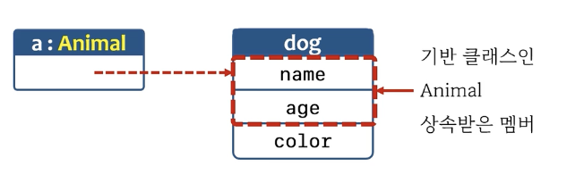

# 11. OOP5

## is, as

### upcasting



- Upcasting
  - 기반 클래스 타입의 참조로 파생 클래스의 인스턴스를 가리킬 수 있다.
  - 기반 클래스 타입의 참조로는 기반 클래스 멤버만 접근할 수 있다.
  - 파생 클래스 고유 멤버에 접근 하려면 파생 클래스 참조 타입으로 캐스팅 되어야 한다.
- 

```swift
class Animal {
  var name = ""
  var age = 0
}

class Dog: Animal {
  var color = 0
}

var d: Dog = Dog()	// ok
var a: Animal = Dog()	// ok. upcasting

a.age = 10	// ok
a.color = 10	// error

```

### is, as

- is 연산자
  - 참조가 가리키는 곳에 있는 인스턴스가 특정 타입의 인스턴스인지를 조사

- as 연산자
  - Downcasting
  - `as?` : 참조가 가리키는 곳에 있는 인스턴스의 타입이 다른 경우 **nil 반환**
  - `as!` : 참조가 가리키는 곳에 있는 인스턴스의 타입이 다른 경우 **런타임 오류 발생.** 참조가 가리키는 곳의 인스턴스 타입을 확신할 수 있을 때만 사용해야 한다. 

```swift
class Animal {
  var name = ""
  var age = 0
}

class Dog: Animal {
  var color = 0
}
var a: Animal = Dog()
print( a is Dog )	// true

// --------------------
var d = a as? Dog
print(type(of: d))	//Optional(Dog)
if d != nil {}
var d1 = a as! Dog
print(type(of: d1))	// Dog

a = Animal()
print( a is Dog )	// false
var d = a as? Dog
print(type(of: d))	//Optional(nil)
var d1 = a as! Dog
print(type(of: d1))	// error
```

```swift
class Animal { var age = 0 }
class Cat: Animal { var color = 0 }
class Dog: Animal {}

var cage1 = [Dog(), Dog(), Dog()]	// Array<Dog>
var cage2 = [Cat(), Cat(), Cat()]	// Array<Cat>
var cage3 = [Dog(), Cat(), Dog(), Dog()]	// Array<Animal>

print(type(of: cage1))	// Array<Dog>
print(type(of: cage2))	// Array<Cat>
print(type(of: cage3))	// Array<Animal>

var cntDog = 0
var cntCat = 0

for e in cage3 {
  if e is Dog { cntDog += 1}
  else if e is Cat { cntCat += 1 }
  
  if let cat = e as? Cat {
    cat.color = 10
  }
}

print(cntDog)	// 3
print(cntCat)	// 1
```

<br>

## init #1

### initializer - init()

- 원칙 : **모든 저장 프로퍼티(stored property)는 반드시 초기화 되어야한다**

  - 방법1. 저장 프로퍼티를 직접 초기화

  - 방법2. Initializer(`init()`)을 사용해서 초기화

```swift
class Person1 {
  var name: String
  var age: Int
  var addr: String?
}	// 인스턴스 생성 안해도 바로 에러난다. 저장 프로퍼티는 초기화 필수

// 직접 초기화
class Person2 {
  var name: String = "unknown"
  var age: Int = 0
  var addr: String?	// 옵셔널은 초기화 안하면 nil
}

// init()으로 초기화
class Person3 {
  var name: String
  var age: Int
  var addr: String?
  init() {
    name = "unknown"
    age = 0
  }
}

var p = Person3()	// 만드는 순간 init 호출


```

- init을 여러개 정의할 수 있다.
  - init을 안만들고, 초기화 된 상태에서 실행해도 기본적으로 swift에서 init을 제공하기 때문에 문제 없다. 
  - 하지만 다른 init이 있는 상태에서 default init이 정의되지 않았다면,  default init으로 인스턴스를 생성하려고 하면 에러가 난다.

```swift
class Person {
  var name: String = "unknown"
  var age: Int = 0
  var addr: String?
  
  init() { print("init()") }
  
  init(name: String, age: Int, addr: String) {
    self.name = name
    self.age = age
    self.addr = addr
    print("init(name: String, age: Int, addr: String)")
  }
}

var p1 = Person()	// "init()"
var p2 = Person(name: "kim", age: 20, addr: "seoul")	// "init(name: String, age: Int, addr: String)"


```

### failable initializer

- init은 일반적으로 반환값이 없다. 하지만 `init?`으로 하면 nil 리턴 하는게 가능하다.
- swift에서는 생성자가 실패했을때는 nil을 반환하는 방법이 있다.

```swift
class Person {
  var name: String
  var age: Int
  var addr: String?

  init?(name: String, age: Int, addr: String?) {
    if name.isEmpty { return nil }
    self.name = name
    self.age = age
    self.addr = addr
  }
}

var p1 = Person(name: "", age: 20, addr: "seoul")
print(type(of: p1))	// Optional<Person>
```

### super.init()

- 파생 클래스를 만들때, 기반 클래스의 initializer를 호출하려면 `super.init()`으로 사용한다.

```swift
class Person {
  var name: String
  var age: Int
  var addr: String?

  init(name: String, age: Int, addr: String?) {
    self.name = name
    self.age = age
    self.addr = addr
  }
}

class Student: Person {
  var id: Int
  
  init(name: String, age: Int, addr: String?, id: Int) {
    self.id = id
    super.init(name: name, age: age, addr: addr)
  }
}
var p1 = Student(name:"kim", age: 20, addr: "seoul", id: 10)

```

### struct memberwise initializer

- memberwise : 사용자가 initializer를 안만들면 swift에서 제공해 주는것
- **구조체 타입일 때,** 사용자가 init을 만들지 않으면 property 이름으로 초기화 가능한 init이 자동으로 생성된다.

```swift
struct SPoint {
  var x: Int
  var y: Int
}

var sp = SPoint() // error
var sp = SPoint(x:0, y:0)	// ok

class CPoint {
  var x: Int
  var y: Int
}

var cp = CPoint() // error. 에러 안나게 하려면 초기값을 줘야함
var cp = CPoint(x:0, y:0)	// error. 에러 안나게 하려면 init 만들어야함.
```


