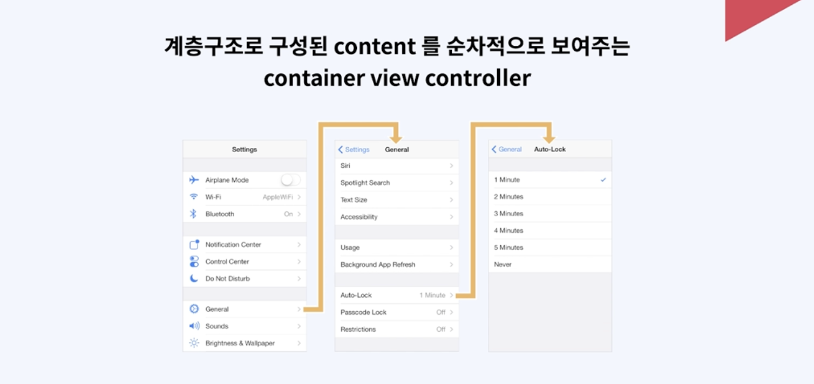
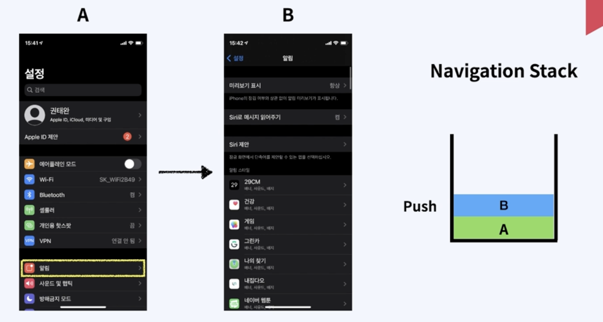
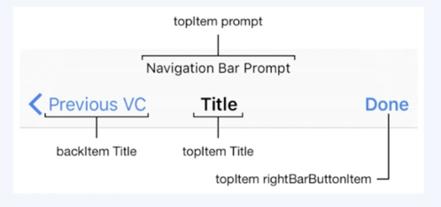
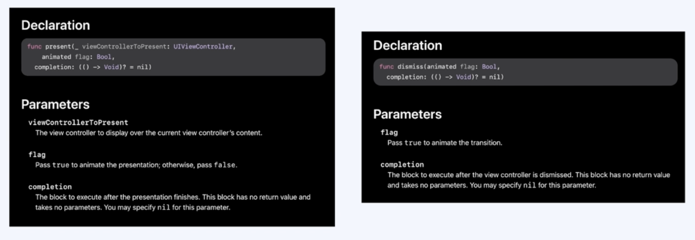
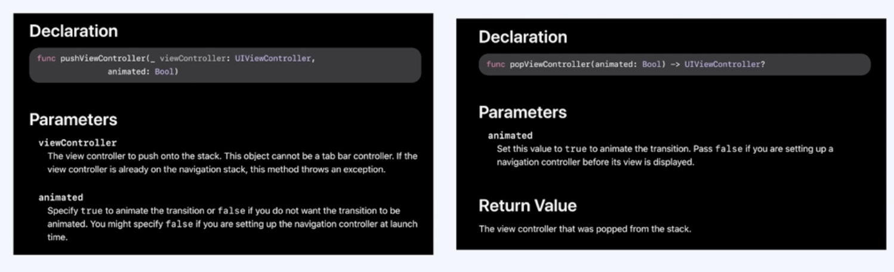
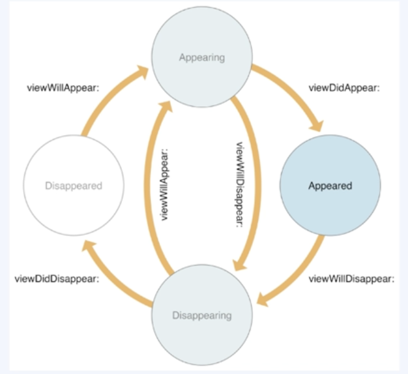
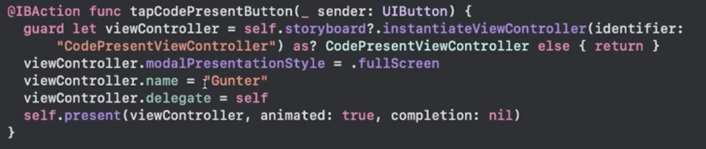

## UINavigationController

### Content View Controller

- 화면을 구성하는 뷰를 직접 구현하고 관련된 이벤트를 처리하는 뷰 컨트롤러
- 일반적으로 흔히 스토리보드 생성시 기본으로 생성되는 뷰 컨트롤 생각하면 됨.

<br>

### Container View Contoller

- 하나 이상의 Child View Controller를 가지고 있다.
- 하나 이상의 Child View Controller를 관리하고 레이아웃과 화면 전환을 담당함.
- 화면 구성과 이벤트 관리는 Child View Controller에서 한다.
- Container View Controller는 대표적으로 Navigation Controller와 TabBar Controller가 있다.


<br>

### Navigation View Controller



- Setting app에서 General을 선택하면, General 자식 View Controller가 표시되게 되고, 이전의 View Controller는 가려지게 된다.
- 최상단 Navigation bar에서 뒤로가기를 누르면 이전에 숨겨진 View Controller가 다 나타나게 됨.
- Navigation View Controller는 네비게이션 스택이라는 정렬된 배열을 사용하여 자식 View Controller를 관리한다.
  - 배열의 첫번째 View Controller는 Root View Controller를 의미하고, Stack의 가장 밑에 있다는 것을 의미한다.
  - 배열의 마지막 View Controller는 스택의 최상단을 의미한다.
- 개발자는 Segueway 를 사용하거나 UINavigationController 메서드를 사용해서 스택으로부터 View Controller를 추가하고, 제거할 수 있음.
- 사용자는 back 버튼을 사용하여 최상단 View Controller를 제거할 수 있고, swipe 제스쳐를 사용해서도 제거할 수 있음.

<br>

### Navigation Stack



- 기본적으로 LIFO 스택 구조임. 나중에 들어온게 먼저 나감.
- 위 그림에서, A가 루트, B가 차일드임.

<br>

### Navigation Bar



- Navigation Controller로 구현할 시 화면 상단에 항상 보여지는 뷰
- 루트 뷰 제외하고는 모두 백 버튼이 있음.

<br>

## 화면 전환 개념

### 화면 전환 방법

- 소스 코드를 통해 전환하는 방식
- Storyboard를 통해 전환하는 방식
- View Controller의 View 위에 다른 View를 가져와 바꿔치기
  - 되도록 사용하지 말아야할 방법.
  - 메모리 누수 위험 있음.
- View Controller에서 다른 View Controller를 호출하여 전환하기
- Navigation Controller를 사용하여 화면 전환하기
- 화면 전환용 객체 세그웨이(Segueway)를 사용하여 화면 전환하기

<br>

### View Contoller에서 다른 View Controller를 호출하여 전환하기



- 현재의 View Controller에서 이동할 대상의 View Controller를 직접 호출해서 화면에 표시
- 직접 호출한다고 해서, Presentation 방식으로 부르기도 함.
- **기존 View Controller 위에 새로운 View Controller를 덮는 방식**
- Present라는 메서드에 이동할 화면의 View Controller를 넘겨주면, 이전 화면에서 이동할 화면의 View Controller가 표시됨.
  - Present 메서드의 첫번째 파라미터에는 이동할 화면의 View Controller 인스턴스를 넣고, 두번째 파라미터에는 화면을 전환할 때 에니메이션 효과를 줄건지 안줄건지 boolean 값을 넣어줌. 세번째 파라미터는 completion이라는 클로저를 전달받고 있는데, 클로저를 정의해주면 화면전환이 완료되는 시점에 맞춰 completion 클로저가 호출되게 됨.
  - 비동기 방식으로 처리되기 때문에, 화면전환이 완료된 이후에 코드로 처리해줘야할 로직이 있다면 completion 클로저 안에 로직을 작성해 주면 됨.
- Dismiss 메서드로 Present 되었던 화면에서 다시 이전화면으로 돌아갈 수 있다.
  - 이전 화면으로 돌아가는 기능이기 때문에, View Controller의 인스턴스를 인자로 받지 않는다.
  - dismiss 메서드의 첫번째 파라미터로는 이전화면으로 돌아갈 때 애니메이션을 적용할지말지 boolean 값을 넣어주고, 두번째 파라미터에는 마찬가지로 completion 이라는 클로저를 전달받고 있는데, 이전화면으로 돌아가는게 완료되면 completion 클로저가 호출된다. 
  - 화면을 걷어내는거라고 생각하면 됨.

<br>

### Navigation Controller를 사용하여 화면 전환.



- 계층적인 성격의 띄는 컨텐츠 구조를 관리하기 위한 컨트롤러.
- View Controller의 전환을 직접 컨트롤하고, 앱에 Navigation 정보를 표시하는 역할을 할 뿐만 아니라, Navigation stack으로 자식 View Controller를 관리함.
- pushViewController라는 메서드를 사용해서, 네비게이션 스택에 화면을 추가하고, popViewController 메서드를 사용하여 네비게이션 스택에 있는 화면을 제거함.
- 네비게이션 스택에 새로운 화면을 표시하는 메서드 : pushViewController
  - 첫번째 파라미터로 새로운 화면의 View Controller 인스턴스를 넘겨줌.
  - 두번째 파라미터는 화면전환이 될 때 애니메이션을 줄건가 안줄건가 boolean.
- 이전으로 돌아오는 메서드 : popViewController
  - 첫번째 파라미터는 이전화면으로의 화면전환이 될 때 애니메이션을 줄건가 안줄건가 boolean.

<br>

### 화면 전환용 객체 세그웨이 (Segueway)를 사용하여 화면 전환하기.

> segueway는 두개의 뷰 컨트롤러 사이에 연결된 화면전환 객체를 의미함. 스토리 보드를 통해 출발지와 목적지를 직접 지정하는 방식을 segueway를 이용한 화면전환이라고 함.segueway를 이용하면 따로 코드를 사용하지 않고 스토리보드만으로 화면을 전환할 수 있는게 특징임.

- Action Segueway
  - 출발점이 Button, cell 등인 경우 
  - 버튼 터치와 같은 트리거 이벤트가 세그웨이 실행으로 바로 연결됨. 그래서 소스코드를 추가하지 않아도 화면 전환을 구현할 수 있음.
  - Action Segueway 종류
    - Show : 가장 일반적인 세그웨이. 네비게이션 컨트롤러를 사용하면 화면 전환시 뷰 컨트롤러가 네비게이션 스택에 쌓이게 되고, 만약 네비게이션 컨트롤러를 사용하지 않을 경우에는 뷰 컨트롤러가 Present 됨.
    - Show Detail: Split view에서 사용하는 세그웨이. 아이폰에서 사용하게 되면 Show 세그웨이 액션과 똑같이 동작하지만, 아이패드에서 사용하게 되면 Split 구조의 마스터 슬레이브 구조가 되서 보이게 됨.
    - Present Modally : 이전 뷰 컨트롤러를 덮으면서 새로운 화면이 나타나게 됨. 프레젠테이션 방식으로 화면이 전환 되는 거라고 생각하면 됨.
    - Present As Popover : 아이패드에서 사용되는 것으로, 팝업창을 띄울때 사용함. 아이폰에서는 사용 안함.
    - Custom : 세그웨이를 사용자가 원하는 방식으로 커스텀할때 사용함.
- Manual Segueway
  - 출발점이 View Controller 자체인 경우
  - 적절한 시점에 perform segue라는 메서드를 호출하면서, 세그웨이가 실행되어 화면전환이 일어남

<br>

## ViewController Life Cycle

> 보통 앱을 만들때 단일 스크린 위에서 여러개의 ViewController들로 화면전환이 가능한 앱을 만든다. 앱이 복잡해질수록 컨트롤러들을 잘 관리해줘야하는데, 알맞은 타이밍에 내가 원하는 코드를 작성하는 것이 중요하다. 이를 위해 ViewController Life Cycle를 이해해야한다.



- UIViewController의 객체에는 View 객체를 관리하는 메서드들이 정의되어 있음. 이 메서드들은 각자 자기들이 불러져야 하는 타이밍일때 IOS의 시스템에 의해 자동으로 호출됨.
- UIViewController의 하위클래스를 생성할때 UIViewController에 정의된 이 메서드들을 오버라이드하여 라이프사이클 상황에 맞게 적절한 로직들을 추가할 수 있음.
- 시스템이 어떤 메서드를 언제 호출해야하는지를 먼저 이해해야지 그 시점에 잘 맞춰 UI의 변화나 데이터 변화를 잘 처리할 수 있다.

### View가 보여지는 상황

- Appearing : 뷰가 화면에 나타나는중
- Appeared : 뷰가 화면에 나타나는게 완료 된 상태
- Disappearing : 뷰가 화면에서 사라지는 중
- Disappeared : 뷰가 화면에서 사라진 상태

- UIViewController를 View가 보여진 상태에 따라 시스템에 호출하는 라이프사이클 메서드가 다르다.

#### viedDidLoad()

- 뷰 컨트롤러의 모든 뷰들이 메모리에 로드됐을 때 호출
- 메모리에 처음 로드될 때 딱 한 번만 호출
- 보통 라이프사이클 내에서 딱 한번 호출될 행위들을 이 메소드 안에 정의함
- 뷰와 관련된 추가적인 초기화 작업이나 네트워크 호출 같은 일회성 작업들을 여기다가 정의함.

#### viewWillAppear()

- 뷰가 뷰 계층에 추가되고, 화면에 보이기 직전에 매 번 호출
- 다른 뷰로 이동했다가 돌아오면 재호출
- 뷰와 관련된 추가적인 초기화 작업

#### viewDidAppear()

- 뷰 컨트롤러의 뷰가 뷰 계층에 추가된 후 호출됨.
- 뷰를 나타낼 때 필요한 추가작업.
- 애니메이션을 시작하는 작업.

#### viewWillDisappear()

- 뷰 컨트롤러의 뷰가 뷰 계층에서 사라지기 전에 호출됨
- 뷰가 생성된 뒤 작업한 내용을 되돌리는 작업
- 최종적으로 데이터를 저장하는 작업

#### viewDidDisappear()

- 뷰 컨트롤러의 뷰가 뷰 계층에서 사라진 뒤에 호출
- 뷰가 사라지는 것과 관련된 추가 작업

## View에 데이터 전송

### 하위 view에서 상위 view로 데이터 전송하기

- Delegate 패턴을 활용하는 방법.

```swift
// 하위 view
protocol SendDataDelegate: AnyObject {
  func sendData(name: String)
}

class 하위클래스: UIViewController {
  //delegate 패턴 사용시 var 키워드 앞에 weak 붙여줘야함. 안붙이면 강한 순환 참조가 걸려 메모리 누수 발생할 수 있음.
  weak var delegate: SendDataDelegate?
  
  
  @IBAction func button(_ sender: UIButton) {
    self.delegate?.sendData(name: "swift")
  }
  
}
```




