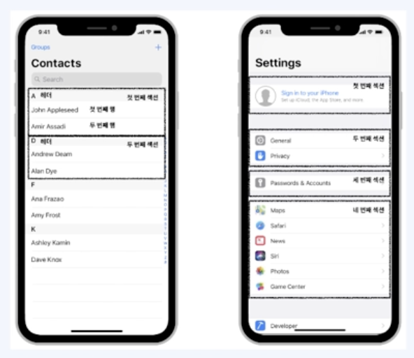
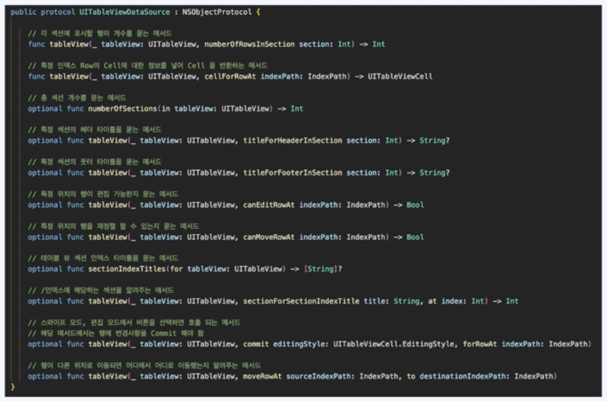
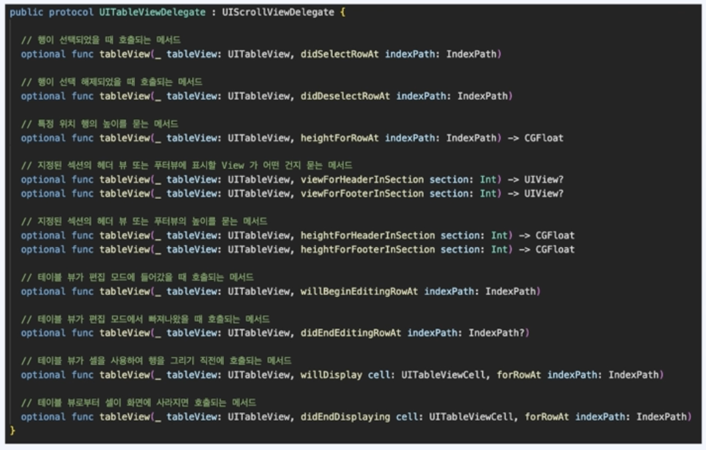

# To Do List 만들기

## UITableView

### UITableView란?

- 데이터들을 목록 형태로 보여줄 수 있는 가장 기본적인 UI컴포넌트
- UIScrollView를 상속받고 있어, Scroll이 가능함.

- 여러개의 Cell을 가지고 있고, 하나의 열과 여러줄의 행을 지니고 있으며, 수직으로만 스크롤 가능함.
- 섹션을 이용해 행을 그룹화하여 콘텐츠를 좀 더 쉽게 탐색할 수 있음.
- 섹션의 헤더와 푸터에 View를 구성하여 추가적인 정보를 표시할 수 있음.

- Table View를 사용하기 위해서는 UITableView DataSource와 UITableView Delegate 프로토콜을 채택하여 구현해야함.
- DataSource는 데이터를 받아 View를 그려주는 역할. Delegate는 TableView의 동작과 외관을 담당함.
- View가 변경되는 사항을 Delegate가 담당하고, View는 Delegate에 의존하여 View를 업데이트 함.
- DataSource에는 총 섹션이 몇개인지, 섹션의 행은 몇개인지, 행에 어떤 정보를 표시할건지 등을 정의할 수 있음.
- Delegate는 행의 높이, 행을 선택하면 어떤 액션을 할건지 등을 정의할 수 있음.

 

### UITableViewDataSource

- UITableViewDataSource는 테이블 뷰를 생성하고 수정하는데 필요한 정보를 테이블 뷰 객체에 제공.

- 여기 메서드들 중에서, optional로 선언 안된 메서드 2가지는 UITableViewDataSource 프로토콜을 채택한  UITableView에서 필수로 구현해 줘야함.

 

### UITableViewDelegate

- UITableViewDelegate는 테이블 뷰의 시각적인 부분을 설정하고, 행의 액션 관리, 엑세서리 뷰 지원, 그리고 테이블 뷰의 개별 행 편집을 도와줌

- 필수로 구현해야하는 메서드는 없음. 

