## UIStackView

- 열 또는 행에 View들의 묶음을 배치할 수 있는 간소화된 인터페이스.
- StackView는 Autolayout을 이용해 디바이스의 스크린 사이즈나 혹은 일어날 어떠한 변화에 맞춰서 동적인 UI를 구성할 수 있음.
- 복잡한 UI를 구성하는데 있어서 일일이 Autolayout 제약조건을 설정하면 제약조건이 많아져 복잡해지기도 하고 관리하기도 힘들어짐. 때때로 원하는데로 UI 구성이 안될수도 있음.
- StackView를 사용하게되면 Autolayout 제약조건을 많이 설정하지 않아도 쉽게 UI구성이 가능함.

- 사용 예시

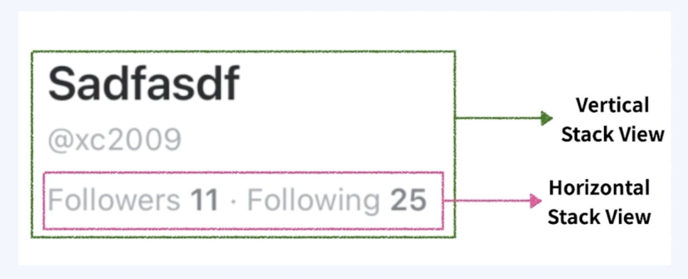

### UIStackView Attribute

> StackView에는 다양한 속성이 있음.

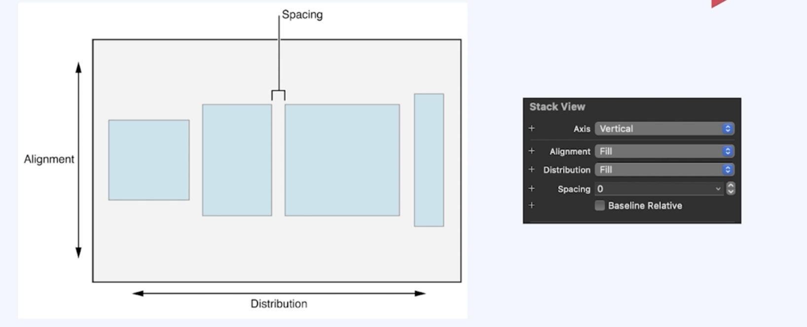

- 스토리보드에서 StackView를 선택하고, 속성 인스펙터로 가면 다양한 속성을 설정할 수 있는 메뉴들이 나온다. 
- StackView는 StackView 안에있는 SubView들의 포지션과 사이즈를 맞추기 위해 속성들을 세팅해 줘야한다. 
- 속성들에는, Axis, distribution, alignment, spacing이 있음.

### StackView Axis

- StackView의 방향을 결정 (가로 또는 세로)

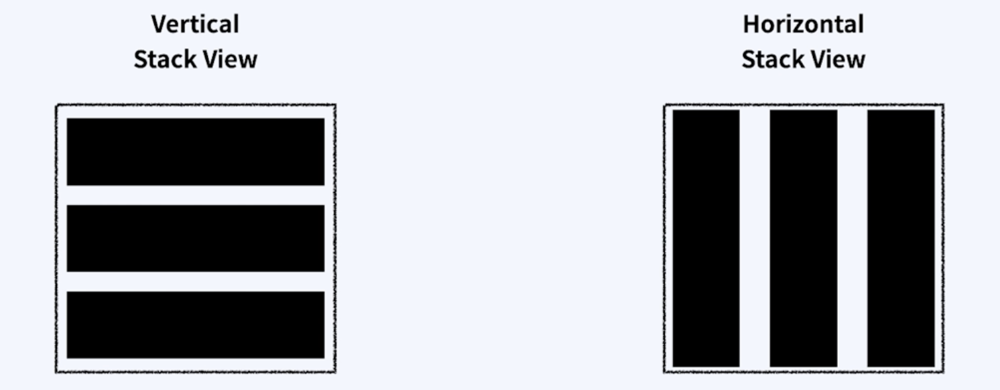

### UIStackView Distribution

- StackView 안에 들어가는 뷰들의 사이즈를 어떻게 분배할지 설정하는 속성
- 다양한 옵션값이 있는데, 아래와 같다.

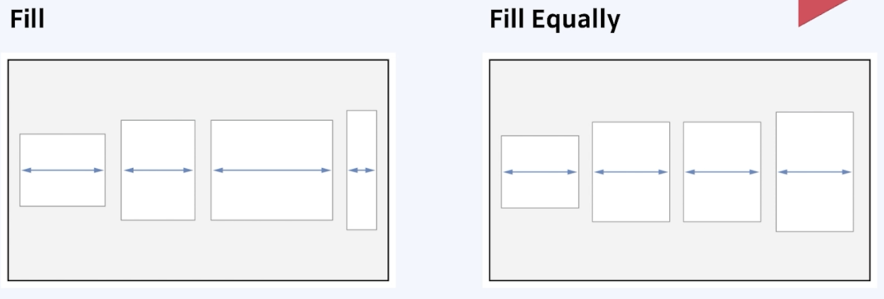

- Fill로 설정하면 사용 가능한 공간을 채우기 위해 SubView들의 크기를 재조정함. StackView의 크기를 초과한다면 각 View의 Compression registance priority에 따라 각 View의 크기를 감소시킴.

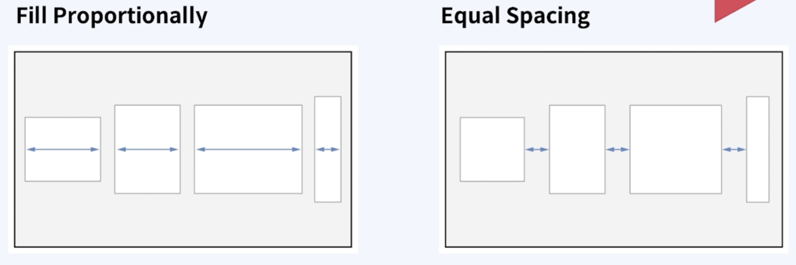

- Fill Proportionally는 StackView의 방향에 따라 SubView 갖고 있던 크기에 비례하여 공간을 차지하도록 만들어줌.
- Equal Spacing은 StackView의 방향에 따라 SubView들 사이의 공간을 균등하게 배치하는 옵션

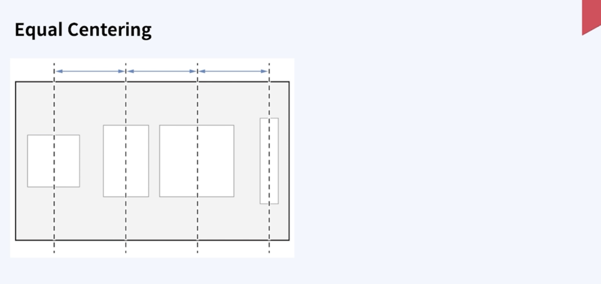

- Equal Centering 은 StackView의 방향에 따라서 각 SubView들의 Center와 Center간의 길이를 동일하게 맞추는 옵션임.

 

### UIStackView Alignment

- StackView의 subView들을 어떤식으로 정렬할 지 결정하는 속성

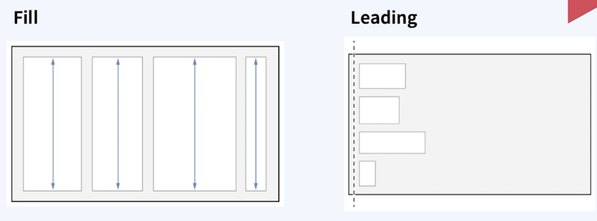

- Fill 옵션은, StackView의 방향이 horizontal일 경우 아래위 공간을 Fill 하기 위해 Subview들을 늘리고 Vertical인 경우는 좌우로 늘림.
- Leading 옵션은 Vertical StackView에서 SubView들이 StackView의 Leading에 맞춰 정렬함.

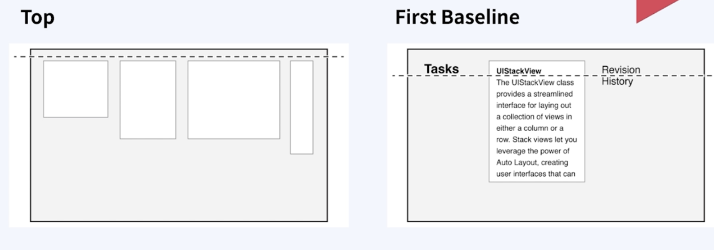

- Top 옵션은, Horizontal StackView에서 SubView들이 StackView에 위로 정렬됨.
- First Baseline 옵션은 Subview들의 First baseline에 맞춰 StackView가 Subview들을 정렬함. 이 옵션은 Horizontal StackView에서만 사용할 수 있음.

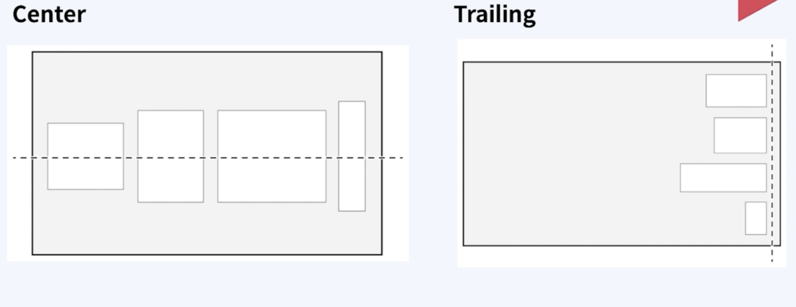

- Center 옵션은 StackView 방향에 따라서 SubView들의 Center를 StackView의 Center에 맞춰 정렬함.
- Trailing 옵션은 Vertical StackView 기준 오른쪽으로 정렬

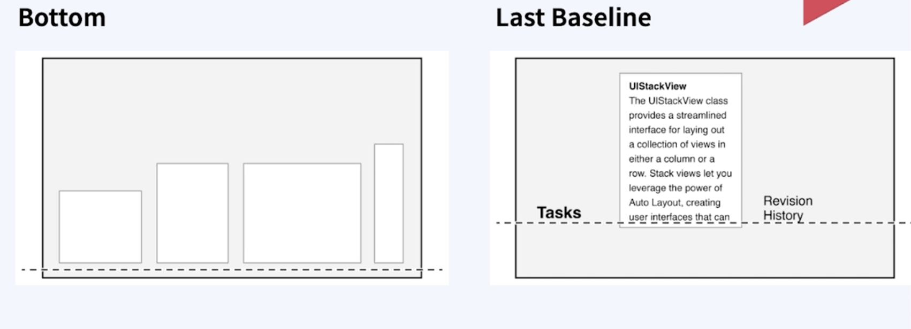

- Bottom 옵션은 Horizontal StackView 기준 아래쪽으로 정렬
- LastBaseline 옵션은 StackView가 View들의 last baseline에 맞춰 정렬함. 이 옵션은 Horizontal StackView에서만 사용할 수 있음.

### UIStackView Spacing

- Stack View 안에 들어가는 뷰들의 간격을 조정하는 속성

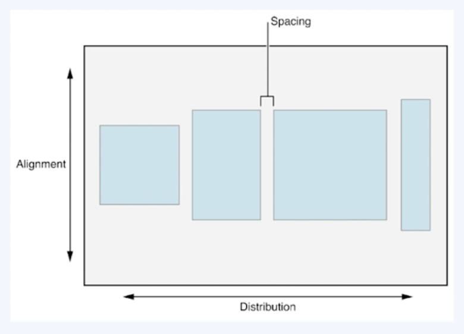