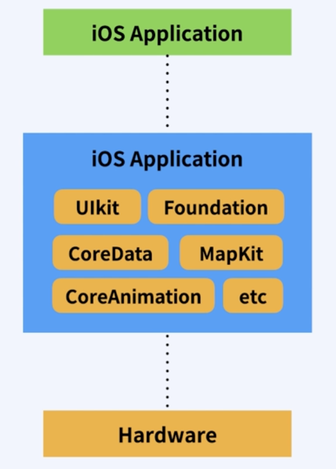
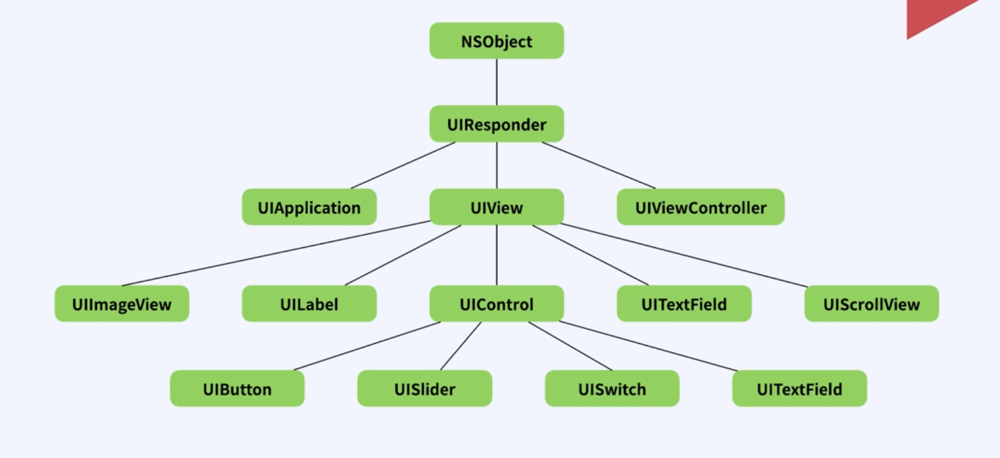
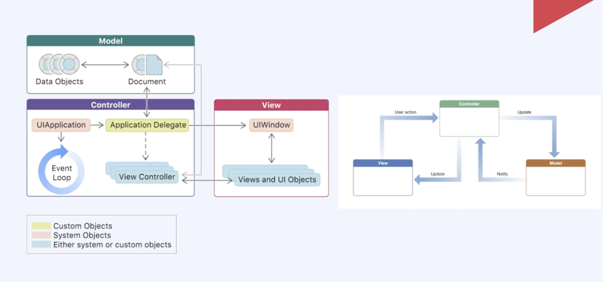
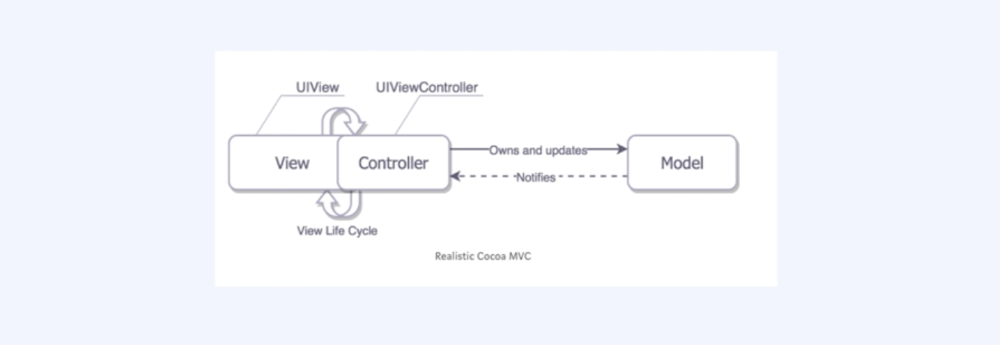
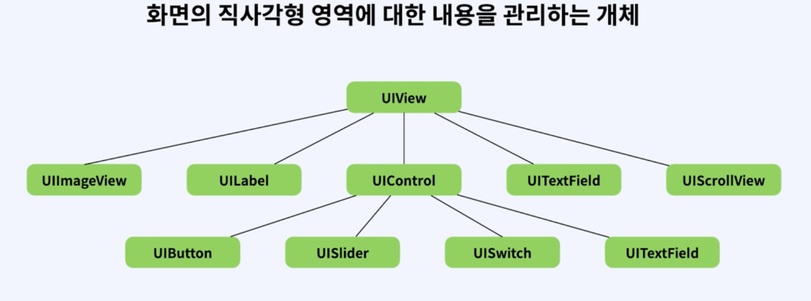
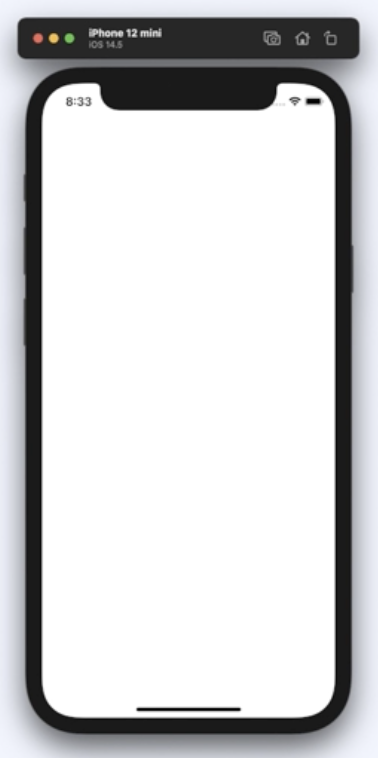
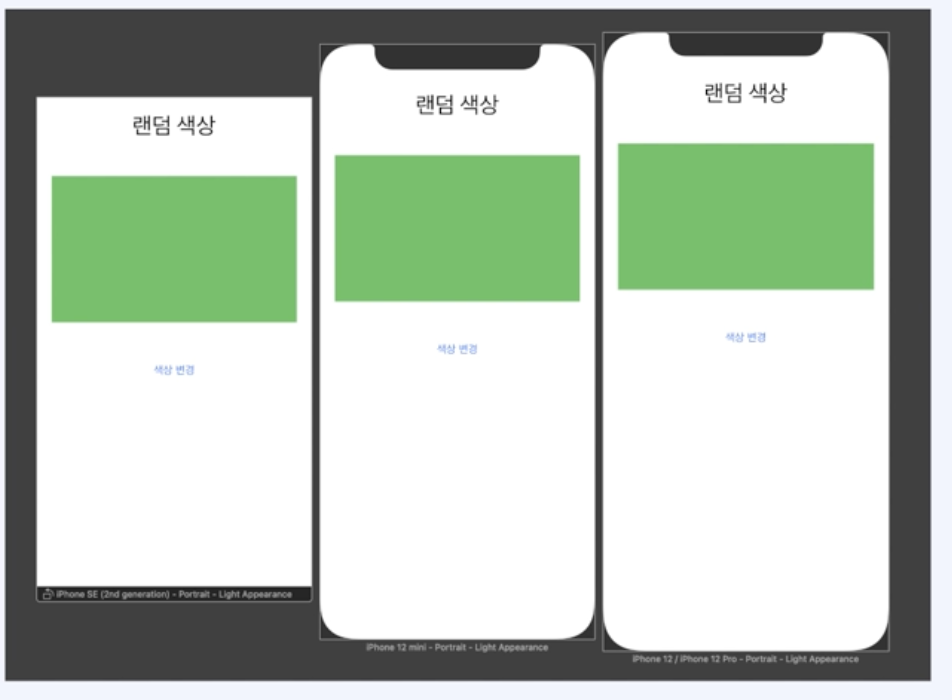
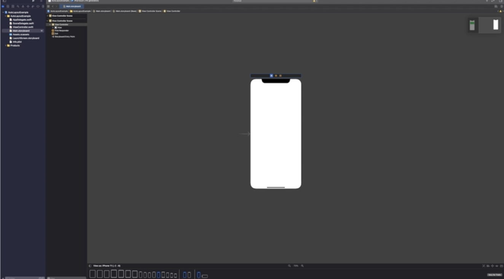
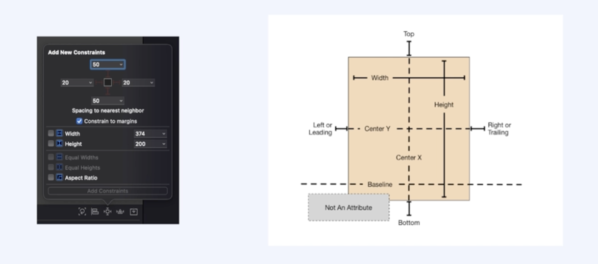
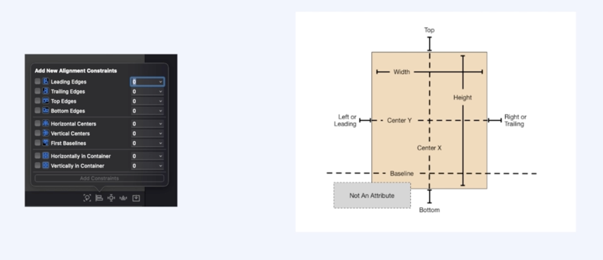

# 명언 생성기 앱 만들기

## UIKit 알아보기

### Cocoa touch Framework

> IOS 개발환경을 구축하기 위한 최상위 프레임워크. 일반적으로 IOS 개발을 위해 Objective-C 혹은 Swift에서 상속하여 사용하는 UIkit, Foundation을 포함한 대부분의 클래스 객체들이 모두 Cocoa touch Framework에 속한다고 생각하면 됨.

- 코코아 터치 프레임워크 중에서도 가장 많이 사용되는게 UIkit과 Foundation이다. 
- Foundation 프레임워크는 가장 기본적인 데이터타입부터 자료구조, 각종 구조체, 타이머, 네트워크 통신 파일 관리 등 기본적인 프로그램에 중심을 담당한다.

### UIKit

> UIkit은 사용자 인터페이스를 관리하고, 이벤트를 처리하는게 주 목적인 프레임워크.

- UIkit 프레임워크는 UI라는 이름에서 알 수 있듯이, 사용자의 인터페이스를 관리하고, 이벤트를 처리하는게 주 목적인 프레임워크임.
- UIKit에서 주로 사용하는 사용자 이벤트로는 제스쳐 처리, 애니메이션, 그림 그리기, 이미지처리, 텍스트 처리 등이 있음. 또, 테이블 뷰, 슬라이더, 버튼, 텍스트필드, 어럴트 창 등 어플리케이션의 화면을 구성하는 요소도 포함되어 있음.
- 그렇기 때문에 자주 사용하는 UIViewController나 UIView 등 UI가 붙는 클래스들을 사용하려면 반드시 UIKit을 import 시켜줘야함.

- UIKit App의 구조
  - 
  - 기본적으로 MVC 디자인 패턴을 사용한다. M은 모델, V는 View, C는 Controller이다. 
  - Model은 앱의 데이터와 비지니스 로직을 가지고 있다.
  - View는 사용자에게 데이터를 보여주는 UI를 담당함.
  - Controller는 모델과 View의 중간다리 역할로, View로 부터 사용자의 액션을 전달 받아서 Model에게 어떤 작업을 해야하는지 알려주거나, 모델의 데이터 변화를 View에게 전달하여, View를 어떻게 업데이트 할 지 알려준다.
  - 쉽게 얘기하면 **Model이 무엇을 Controller가 어떻게, View가 보여줄 것인가** 라고 생각하면 됨.
  - 위 그림처럼, View와 Model의 상호 의존성을 없애고, Controller가 중간다리 역할을 해주는게 MVC 패턴의 가장 이상적인 형태임.
- 현실의 UIkit App 구조
  - 
  - 애플의 MVC 패턴에서는 View와 View Controller가 너무 친하다.
  - 무슨 뜻이냐? View와 Controller가 강하게 연결되어 있어 View Controller가 거의 모든 일을 담당하고, View Controller에서는 Controller가 View의 Life Cycle에 관여하기 때문에 View와 Controller를 분리하기 어렵다.
  - 그래서 프로젝트 규모가 커질수록 Controller가 비대해지고, 내부구조는 복잡하게 되어 유지보수가 힘들어 지는 상황이 온다.
  - 이런 MVC 패턴의 문제점을 해결하기 위해 MVVM이나 Viper 패턴 등 다양한 디자인 패턴으로 해결할 수 있다.

 

## UIViewController 알아보기

### UIView란?

- UIView는 애플 공식문서에 "화면의 직사각형 영역에 대한 내용에 대해 관리하는 개체"라고 명시되어 있다.
- 화면을 구성하는 요소의 기본 클래스라고 생각하면 된다.
- UIVIew는 위치와 크기를 갖는 사각형으로, 배경색을 가지고 있고 또 문자나 이미지 등의 컨텐츠를 갖는게 가능하다
- 위 그림 처럼, 여러 UI 컴포넌트들의 부모 클래가 UIView이다. 
- 그래서 UIView는 여러 UI 컴포넌트들을 보여주는 용도로 사용한다.

### ViewController란?

- 앱이 근간을 이루는 객체로, 모든 앱은 최소한 하나 이상의 View Controller를 가지고 있다.
- 한마디로 사용자가 화면을 보는것에 대한 관리 기능을 제공한다.
- 화면을 만든 후에 시뮬레이터를 실행시켜보면 위 그림과 같은 화면을 볼 수 있는데, 이게 View Controller라고 보면 된다.
- View Controller의 주요 역할
  - 데이터 변화에 따라서 view 컨텐츠를 업데이트
  - view들과 함께 사용자 상호작용에 응답
  - view를 리사이징하고 전체적인 인터페이스의 레이아웃 관리
  - 다른 뷰컨트롤러들과 함께 앱을 구성한다.
- 우리가 앱을 사용할 때, 화면마다 다른 컨텐츠가 표시되고, 화면을 터치해서 다른 화면으로 이동할 수 있는데, 이게 View Controller의 역할이다.
- 화면 하나를 관리하는 단위라고 생각하면 된다.

 

## AutoLayout

### AutoLayout 이란?

- 제약조건(Constraints)을 이용해서 뷰의 위치를 지정하는 것
- AutoLayout은 아이폰의 다양한 해상도 비율에 대응하기 위해 나온 개념. 아이폰의 크기가 다양해지면서 해상도도 달라졌는데, 다른 크기에서도 화면을 똑같이 보여주기 위해 AutoLayout을 사용한다.
- AutoLayout은 세로 보기 화면 뿐만 아니라 가로보기 화면까지 지원한다.
- 위 그림을 보면, 디바이스 크기가 달라도 모두 UI가 일정한 것을 볼 수 있다.

### Storyboard

- AutoLayout을 이용한 화면 구성은 Storyboard에서 하면 된다. xcode 파일 네이게이터에서, 스토리보드를 선택하면 아래와 같은 그림이 나옴.
- 
- Storyboard는 IOS 앱에 사용자 인터페이스를 시각적으로 표현하여 컨텐츠 화면과 화면간의 연결을 보여주는 도구이다.
- Storyboard는 Scene으로 구성되며, 각 씬은 뷰컨트롤러와 뷰를 나타낸다.
- 여러 화면들을 스토리보드를 사용해 만드는 것이다.

- 제약조건을 이용해서 뷰의 위치를 지정해 줄 수 있는 다양한 메뉴가 존재한다.
  - Add New Constraint
    - 뷰간의 제약조건을 설정할 수 있는 메뉴이다.
    - 
  - Align
    - 뷰 간의 정렬을 설정할 수 있는 메뉴.
    - 
    - 다른 뷰와의 가로 세로 정렬과 같은 정렬 제약 조건을 추가할 수 있다.
    - 정렬하고 싶은 두개의 뷰를 선택하여 수직 정렬, 수평 정렬을 추가할 수도 있음.
  -  Resolve Auto Layout Issues
    - Auto Layout관련 이슈들을 해결하는 옵션들을 제공함.
    - 현재 제약조건들을 기준으로, 뷰를 업데이트 하거나 캔버스 안에 뷰의 현재 위치를 통해 제약을 업데이틀 할 수 있다.
    - 누락된 제약을 추가하거나 제약을 삭제하거나, 추천하는 제약 조건을 활용할 수 있음.
    - 그렇게 많이 사용하는 메뉴는 아님.

 

## IBOutlet 과 IBAction

### Outlet

- 스토리보드에 등록한 UIObject에 접근하여 컨트롤 하기 위해, 변수에 바인딩 한 UIObject 변수를 뜻함.
- 얘를들어 UIView에 백그라운드 컬러를 초록색에서 파란색으로 변경시키려면 IBOutlet을 사용해서 뷰컨트롤러 클래스에 Outlet 변수를 추가시켜줘야 코드상에서 UIView의 백그라운드 컬러를 변경할 수 있다.
- 참고 : Storage에서 이 변수를 strong으로 설정할지 weak로 설정할 지 지정할 수 있는데, 메모리 회수 정책을 나타내는 것임.
  - strong : 다른 곳에서 참조하고 있는 경우에 메모리에서 제거되지 않음. 메모리 누수가 발생할 수 있는 여지가 생김.
  - weak : 다른 곳에서 참조하고 있더라도 시스템이 인위적으로 메모리에서 제거할 수 있음.
  - 추후 다룰 예정.

### Action

- 동작을 정의하는 함수. 어떠한 동작을 할 수 있도록 정의하고 연결 시켜주는 역할
- 예를들어 색상 변경 버튼을 클릭하면 UIView의 백 그라운드 컬러가 변경되게 하게 할 때, 연결할 수 있다.

