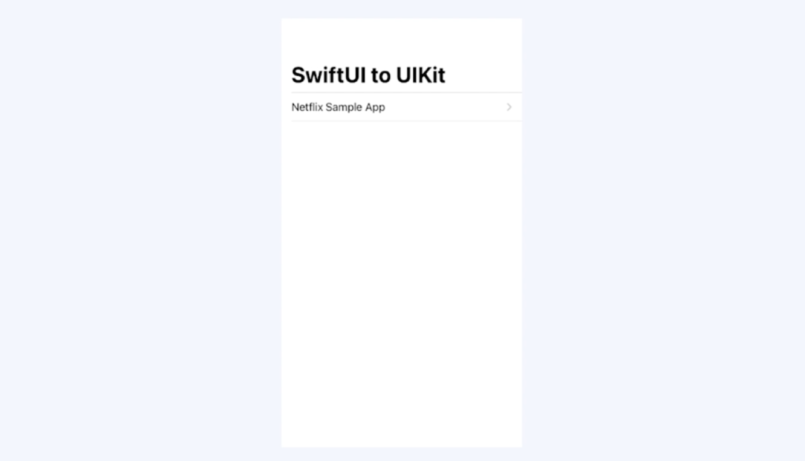

# SwiftUI

> The shortest path to a great app. The shortest path to a great UI


- SwiftUI는 UI framework에서 기대할 수 있는 모든 기본 기본 구성 요소를 포함하고 있다.
- Button이나 Textfield 같은 컨트롤이 있고, stack, list 같은 레이아웃 컨테이너가 있음. 또 애니메이션, 제스쳐까지 포함하고 있다.
- 즉, 완전히 새로운 방식이지만, 생소하진 않다.

<br>

## 명령형과 선언형

- SwiftUI는 코드 작성과 앱 성능 면에서 차이를 낼 수 있다라고 표현함.
- SwiftUI에서는 우리가 익숙하게 사용했던 명령형 프로그래밍 방식이 아닌 선언형 프로그래밍 방식으로 코드를 작성한다.
  - 명령형 : "어떻게"
    - 샌드위치를 만들때, 어떤 재료를 가져와야하는지, 어떤 장비가 필요한지, 토스트를 어떻게 만들면 되는지 안내한다.
    - 하나하나 안내 해주는건 좋지만, 너무 길고 지루하기도 하다. 중간과정을 놓치면 최종 결과가 의도했던 것과는 다를 것이다.
  - 선언형 : "무엇을"
    - 샌드위치 만들때, 그냥 원하는 샌드위치를 얘기한다. 
    - 햄야채 샌드위치 주세요. 소금 후추 조금 뿌려서요.

- 명령형 코드 예시


- 선언형 코드 예시


<br>

## SwiftUI 알아보기

> SwiftUI는 iOS, macOS,watchOS, tvOS 등 애플이 제공하는 모든 플랫폼에서 앱에 사용자 인터페이스와 동작을 선언하게 됨. 

- SwiftUI는 앱에 사용자 인터페이스를 선언하기 위한 View, Controll, Layout을 Struct 형태로 제공한다.
- 이 프레임 워크는 탭이나 제스쳐, 기타 유형의 입력을 앱에 전달하기 위한 이벤트 핸들러, 앱 모델에서 사용자가 보고 상호작용을 할 view, controll에 대한 데이터 흐름을 관리하는 도구를 제공함.

### SwiftUI의 View

- Views are a function of state, not of a sequence of events
- 여기서 View는 UIkit의 UIView랑은 조금 다르다.
- UIkit의 View는 UIComponent 중에 하나일 뿐이지만, SwiftUI에서 View는 function of the state. 즉 상태의 함수라고 표현한다.


- 이는 표현하고자 하는 View. UI의 속성은 상태로 표현되고, 이러한 상태를 함수 형태의 인자로 전달을 하면, 세세한건 SwiftUI 프레임워크가 알아서 해석해서 View로 표현할거다! 라는거임.

<br>

### Property Wrapper

- SwiftUI에서의 View는 데이터 흐름의 일원화, 그러한 데이터를 뿌려주는 View의 역할은 무엇이냐 라는 고민을 토대로 디자인 되었다고 함.


- 따라서 이러한 데이터 흐름 기준으로 여러 Property Wrapper라는 개념을 도입했는데, 여기서 데이터 흐름이 View의 내부냐, 외부냐에 따라 `@State`와 `@ObservableObject`로 나눌 수 있다.
- 또한, `@State`는 값 타입이고, `ObservableObject`는 참조타입이다. 
- 또, @State로 선언한 경우 프레임워크 자체적으로 관리해 주는 반면, @ObservableObject는 개발자가 직접 선언체를 관리해 줘야함.

<br>

### SwiftUI의 Data Flow


- 외부 디펜던시가 없는 단일 view라고 했을때, 발생하는 어떤 이벤트는 유저 인터렉션을 통한 액션이 있을 것이다. 
- 이렇게 유저 인터렉션으로 액션이 발생하면, 이 액션이 State의 상태를 변화 시킬것이고, 그에 대한 업데이트가 View에 전달되는 방식일 것이다.
- 최종적으로 업데이트에 따라서 View는 새롭게 rendering하고 이게 유저에게 보여지게 된다.

<br>

### Custom View 만들기

- 기존의 명령적 접근 방식을 사용하면, Controller 코드가 View를 인스턴스화 하고, Layout을 구성할 뿐만 아니라 조건이 변경됨에 따라서 지속적으로 업데이트 해야하는 부담이있었다.
- 선언적 접근 방식에서는 인터페이스가 원하는 layout을 미러링하는 계층 구조에서 View를 선언하고, 사용자 인터페이스에 대한 간단한 설명을 만들게 됨.
- 그런 다음, SwiftUI는 사용자의 입력, 상태 변경과 같은 이벤트에 대한 응답으로 View를 그리고, 업데이트 하는걸 관리하게 됨.
- SwiftUI는 사용자 인터페이스에서 View를 정의하고, 구성하기위한 도구를 제공한다.

<br>

## SwiftUI 알아보기 1

```swift
struct MyView: View {
    var body: some View {
        VStack {
            Text("hi")
            Text("hello")
        }
    }
}
```

- View 프로토콜을 준수하는 struct 구조체를 정의해서 custom view를 선언할 수 있다.
- 다른 프로토콜과 마찬가지로 View 프로토콜은 기능에 대한 청사진을 제공한다. View 프로토콜은 SwiftUI가 화면에 그리는 요소의 동작을 나타내게 됨.
- 프로토콜에는 이 view가 충족해야하는 요구사항과 프로토콜이 제공하는 기능이 모두 포함됨. 요구사항이 충족된 이후에 사용자 정의 view를 view hirechy에 삽입을 해서 앱 사용자 인터페이스에 일부가 되도록 할 수 있음.
- View 프로토콜의 필수사항은 body라는 것을 정의해야 한다는 것임. SwiftUI의 View는 View를 업데이트 해야할 때 마다 body 속성의 값을 읽게 됨. 업데이트 되는 view는 일반적으로 사용자의 입력, 또는 시스템 이벤트에 대한 응답으로 View 수명동안 반복적으로 발생할 수 있다.
- 그래서, View가 반환하는 값은 곧 SwiftUI가 화면에 그리는 요소임.
- some View라는 syntax를 통해서 이 body의 속성이 View를 준수하는구나 라고만 표시하고 있는것임. 즉 정확하게 어떤 유형일지는 body 부분을 어떻게 개발하는지에 따라 달라지는, 즉 body 내용에 따라서 달라지게 됨.
- SwiftUI는 정확한 유형을 명시적으로 표현하지 않고 프레임워크 단에서 자동으로 추론하기 위해 some View라고 표현하고 있다.
- VStack를 사용하는 것 같이 여러 sub View를 사용하는 View는 일반적으로 View builder 속성으로 표시된 클로저를 사용해서 나타나게 됨. 
- VStack 안에 클로저가 있고, 클로저 내에서 구현을 하게 되는 것임.
- 이렇게, View의 body에서 View를 구성하려면, View Modifier를 적용할 수 있는데, modifier는 특정 뷰에서 호출되는 메서드라고 보면 됨. 따라서 메서드이기 때문에 View 계층 구조에서 기존의 View를 대체하여 변경된 새 View를 반환하게 됨.
- SwiftUI는 이러한 목적을 위해 다양한 메서드 셋으로 View 프로토콜을 확장하게 됨. View 프로토콜을 준수하는 모든 요소들은 어떤 방식으로든 View의 동작을 변경하는 메서드에 엑세스할 수 있다. 예를들어 .font modifier를 사용해서 Text의 폰트를 바꿀 수 있다.
- View에서 init()을 통해 커스텀한 코드를 최대한 작성하지 않는것이 좋다. SwiftUI 언제든지 초기화 하면서 관리하기 때문이다.

<br>

## Container View 선택하기

### Stack View

- SwiftUI에서 사용할 수 있는 가장 기본적인 Layout Container.
- Stack을 사용해서 View 컬렉션을 수평선 혹은 수직선으로 그룹화하거나 서로의 위에 쌓을 수 있음


- HStack은 View를 수평 배치, Vstack은 View를 수직선 배치, Zstack은 View를 Overlay하게 됨.
- 기본 매개변수로 초기화하면 Stack View가 contents를 가운데 정렬한 다음 그 안에 포함된 각 View 사이에 약간의 간격을 자동적으로 설정하게 됨. 
- View modifier, Spacer, divider view 등을 사용해서 Stack을 결합하고, 사용자 정의를 할 수 있음.

<br>

### Stack, LazyStack


- VStack, HStack, LazyHStack 및 LazyVStack을 사용해서 View 또는 View 그룹을 반복 할 수도 있음. 위 그림처럼 contents가 container 범위를 넘어서서 확장될 수 있도록 ScrollView 내부에 Stack 뷰를 배치

- 사용자는 VStack이나 HStack을 사용해서 수평, 수직 또는 양방향으로 동시에 스크롤 할 수 있다.
- Stack View와 Lazy View는 기능이 비슷하고 상호 교환 가능하다고 느낄 수 있지만, 사실 서로 다른 상황에서 각각의 장점이 있음. 절대적인건 없음.
- Stack View는 자식 View를 한번에 load 하기 때문에 layout을 빠르고 안정적이게 보일 수 있다. 왜냐하면, 시스템 단에서 로드를 할 때 하위 View의 크기와 모양을 다 알고 있기 때문임.
- 반면 LazyStack은 성능을 위해서 어느정도 Layout 정확성을 등가교환하는 느낌임. Lazy의 경우에는 하위 View가 표시 될 때만 그 크기와 위치를 계산을 하게 됨. 그때그때 Container 안에 들어 왔을때만 정확한 위치와 크기를 계산함.
- 애플은 사용할 Stack View 유형을 사용할 때 항상 기본적으로는 기본 Stack을 사용하고, 성능향상이 의미 있는 경우(자식 View가 너무 많은 경우, 예측 불가능한 경우)에만 LazyStack을 사용하는걸 추천하고 있음.

<br>

### Grid


-  View를 수평이나 수직으로 동시에 배치하려면 LazyVGrid, LazyHGrid를 사용하라고 하고 있음.
- 어떤 면에서는 table View와 비슷하고, collection View와도 비슷한데, Grid는 위 같은 Image gallery 처럼 정사각형 container에 자연스럽게 표시되는 컨텐츠를 layout하는데 적합한 container임
- 더 큰 장치에 표시하기 위해서 사용자 인터페이스 레이아웃을 확장하기 위해서도 잘 쓸 수 있음
- 예를 들어, 아이폰의 연락처 정보 디렉토리는 아이폰의 목록 또는 수직 Stack에 적합할 수 있지만 아이패드나 맥과 같이 화면이 더 큰 장치로 확장할 때는 Grid형태가 더 자연스러울 수 있음. 

<br>

### List



- 기본적으로 포함된 항목 주변과 그 항목 사이에 플랫폼에 적합한 시각적 스타일이 포함됨. (divider 역할을 하는 것이라던가, 링크가 있어서 셀을 누르면 다음 컨텐츠가 보이는 아이콘이 포함되거나)
- 예를들어, iOS에서 실행할 때 어떤 List의 기본 구성은 행 사이에 구분선을 추가하게 되고, 탐색하는 항목이나 네비게이션 뷰에 discloser indicator를 표시하게 됨.
- List는 항목을 삽입하고 재정렬하고 제거하는 것과 같은 일반적인 작업에 대한 플랫폼에 적합한 상호작용도 지원함. 예를 들어 목록 내부에 Foreach에 Ondelete 같은 수정자를 추가할 수 있음. 추가하면 항목을 Slide 했을때 delete 표시됨. 
- LazyHStack, LazyVStack과 마찬가지로 List 내부의 행도 말 그대로 lazy하게 로드됨. 리스트는 본질적으로 필요할 때 스크롤이 됨. scroll 액션을 주면 자동적으로 스크롤 되는 것임. Scroll view 안에 List를 넣을 필요 없음.
- Stack이나 Grid 보다는 Scrolling이 필요하고, 데이터 핸들링이 필요할 경우에는 Scroll View 위에 Stack을 올리는것도 방법이지만, List를 사용할 수 있음.

<br>

### Form


- Form을 사용하면 시스템 표준 컨트롤을 사용하는 데이터 입력 인터페이스, 어떤 기본 설정 화면을 구축하는데 좋다.
- 왼쪽은 iOS 설정화면, 오른쪽은 macOS 설정화면. 이 두가지 모두 설정하려는 내용은 똑같다. SwiftUI를 사용해서 개발을 하게되면 따로따로 표현할 필요가 없이, Form을 사용하면 각각의 플랫폼에 적합한 방법으로 자동으로 내용을 표시하게 됨.
