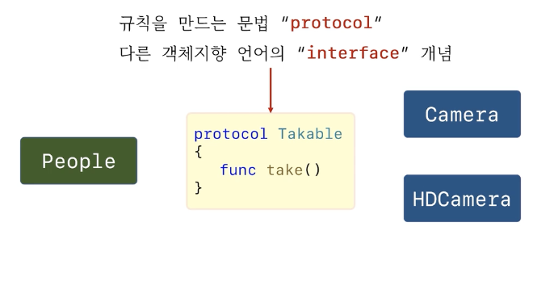
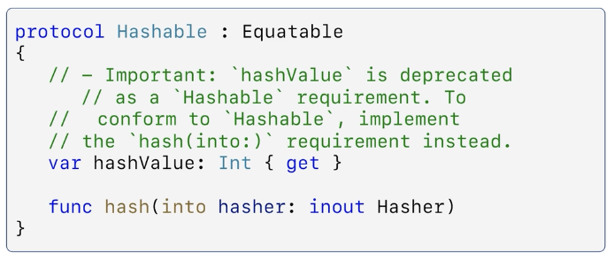
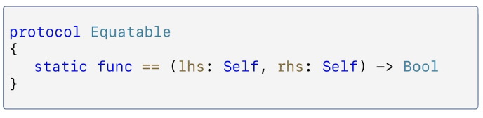

# 12. OOP6

## protocol #1

- 다른 객체 지향 언어의 interface 개념

### 강한 결합 (tightly coupling)

- 하나의 클래스가 다른 클래스 사용 시 클래스 이름을 직접 사용.
- 교체 불가능한 경직된 디자인.
- 아래 코드에서, People은 "Camera" 클래스만 사용할 수 있고, "HDCamera" 등 다른 클래스는 사용할 수 없다.

```swift
class Camera {
  func take() { print("take picture") }
}

class HDCamera {
  func take() { print("take HD picture") }
}

class People {
  func useCamera(camera: Camera) { camere.take() }
  // func useCamera(camera: HDCamera) { camere.take() }	// 이 코드를 넣어야 아래 코드가 에러가 안날것이다. 근데, 카메라가 추가된다고 했을 때 계속 이런식으로 코드를 추가해줘야한다.
}

var p = People()
var c = Camera()
p.useCamera(camera: c)

var hdc = HDCamera()
p.useCamera(camera: hdc)	// error Camera type에 HDCamera를 넘길 순 없다.
```



- 컴퓨터에 다양한 USB 메모리를 사용할 수 있다.
  - 컴퓨터와 USB 메모리 사이에 지켜야하는 "규칙이 미리 정의되어 있기 때문에 가능"
  - USB는 규칙대로 만들고, 컴퓨터는 규칙대로 사용
- People 클래스가 다양한 카메라를 사용할 수 있으려면
  - People과 카메라 간에 지켜야 하는 "규칙을 먼저 설계" 해야한다.
  - 규칙을 만드는 문법 : `protocol`
- People은 규칙대로 카메라를 사용
  - useCamera(camera: Takable)
- 모든 카메라들은 규칙대로 설계 되어야 한다. 이를 "Protocol을 채택(adopt) 한다" 고 표현
  - `class Camera: Takable`

```swift
protocol Takable {
  func take()	// 함수의 모양만. 인자가 있다면 인자 표현, 반환값이 있다면 반환값 표현
}

class Camera: Takable {
  func take() { print("take picture") }
}

class HDCamera: Takable {
  func take() { print("take HD picture") }
}

class UHDCamera: Takable {
  func take() { print("take UHD picture") }
}

class People {
  func useCamera(camera: Takable) { camere.take() }
}

var p = People()
var c = Camera()
p.useCamera(camera: c) // ok

var hdc = HDCamera()
p.useCamera(camera: hdc)	// ok

var uhdc = UHDCamera()
p.useCamera(camera: uhdc)	// ok
```

### protocol의 장점

1. 확장성
   - People은 미래에 만들어질 새로운 카메라도 사용할 수 있다.
   - 단, 새로운 카메라는 규칙을 지켜야한다. (Takable protocol 준수(conform))
2. 일관성
   - 모든 카메라는 동일한 이름의 메서드 "take"를 가지고 있다.
   - 모든 카메라의 사용법은 동일함을 보장.

<br>

## protocol #2

- 프로토콜 자체로는 인스턴스를 만들 수 없다.

```swift
protocol Takable {
  func take()	
}

class Camera: Takable // protocol adopt(채택)
{	
  // 아래 take 함수를 만들지 않으면 error
  func take() { print("take picture") }
}
// 프로토콜의 요구사항을 만족한다? -> protocol conformance(준수)

var c = Camera()

var t1: Takable = Takable()	// 프로토콜 자체는 인스턴스를 생성할 수 없다. error
var t2: Takable = Camera()	// 프로토콜의 타입으로 참조변수를 만들수는 있다. ok
```

- 프로토콜을 만들때 메서드 뿐만 아니라 프로퍼티, subscript, initializer도 만들 수 있다.

```swift
protocol AProtocol {
  func foo()
}

protocol BProtocol: AProtocol {
  var propA: Int {get set}
  var propB: Int {get}
  
  // subscript
  // init()
}

class MyType: BProtocol {
  var propA: Int {
    get { return 0 } 
    set {}
  }
  
  var propB: Int {
    get { return 0 }
  }
  
  func foo() {
    
  }
}
```

### Hashable protocol

- Set을 사용한다고 해보자. Set은 내부적으로 Hashtable 자료 구조를 쓰기 때문에 **사용자 정의 타입이 Set에 들어가려면 Hashable  protocol을 준수 해야한다.**





```swift
class People {
  let userId: String
  let name: String
  
  init(userId: String, name: String) {
    self.userId = userId
    self.name = name
  }
}

var s: Set<People> = []	// error
```

```swift
class People: Hashable {
  let userId: String
  let name: String
  
  init(userId: String, name: String) {
    self.userId = userId
    self.name = name
  }
  
  func hash(into hasher: inout Hasher) {
    hasher.combine(userID)	// userID를 식별자(Hash key 값)로 쓰겠다. userID로 구분하겠다!
  }
  
  static func == (lhs: People, rhs: People) -> Bool {
    return lhs.userId == rhs.userId
  }
}

var s: Set<People> = []	// ok
```

<br>

# 13. Advanced Topic

## generic

- 타입에 무관한 함수를 만들기 위해 generic을 사용할 수 있다.

```swift
func myswap(_ a: inout Int, _ b: inout Int) {
  let temp = a
  a = b
  b = temp
}

var n1 = 10
var n2 = 20

var d1 = 3.4
var d2 = 1.2

myswap(&n1, &n2)
myswap(&d1, &d2)	// error. Integer만 받는데 Double을 넘기면 안되지 당연히
```

```swift
// 나 generic으로 할꺼니까 임의의 타입에 대해 동작할 수 있게 해달라!
// T 말고 다른 용어를 써도 되지만 관례상 T를 사용한다. 혹은 G
func myswap<T>(_ a: inout T, _ b: inout T) {
  let temp = a
  a = b
  b = temp
}
// T: Template

var n1 = 10
var n2 = 20

var d1 = 3.4
var d2 = 1.2

myswap(&n1, &n2)
myswap(&d1, &d2)

print(n1, n2)	// 20 10
print(d1, d2)	// 1.2 3.4
```

### generic constraint (규약; 제약)

- `<T: Protocol>`

```swift
func isSameValue<T>(_ a: T, _ b: T) -> Bool {
  return a == b
}

var n1 = 10
var n2 = 10

print(isSameValue(n1,n2))	// error. 왜냐하면 a,b의 상등 연산을 보장할 수 없다.

// 수정하면
// 나 임의의 타입인데, 어떤 프로토콜을 준수하는 것만 할게!
func isSameValue<T: Equatable>(_ a: T, _ b: T) -> Bool {
  return a == b
}

var n1 = 10
var n2 = 10
print(isSameValue(n1,n2))	// true

class Car {}

var c1 = Car()
var c2 = Car()
print(isSameValue(c1, c2))	// error. Car는 Equatable 프로토콜을 준수하지 않기 때문.

```

```swift
func add<T>(_ a: T, _ b: T) -> T {
  return a + b
}

var ret = add(10, 20)	// error. 임의의 타입 T에 대해 + 연산이 가능함을 보장할 수 없다.

// 수정하면
func add<T: AdditiveArithmetic>(_ a: T, _ b: T) -> T {
  return a + b
}

var ret = add(10, 20) // ok.

```

``` swift
func isLessThan<T>(_ a: T, _ b: T) -> Bool {
  return a < b
}

print(isLessThan(10, 20))	// error

// 프로토콜을 만들어서 적용할 수도 있다.
protocol LessThan {
  // Self: 자기 자신의 타입
  // 자기 타입 2개를 받아서 < 연산을 하고 결과로 Bool이 나와야한다!
  static func < (_ a: Self _ b : Self) -> Bool
}

func isLessThan<T: LessThan>(_ a: T, _ b: T) -> Bool {
  return a < b
}

extension Int: lessThan {}	// 이미 Int 타입 내부적으로 위 프로토콜에 대한 내용이 들어가 있어서, 따로 구현하지 않아도 된다.
extension Double: lessThan {} // Double도 마찬가지.

print(isLessThan(10, 20))

```


