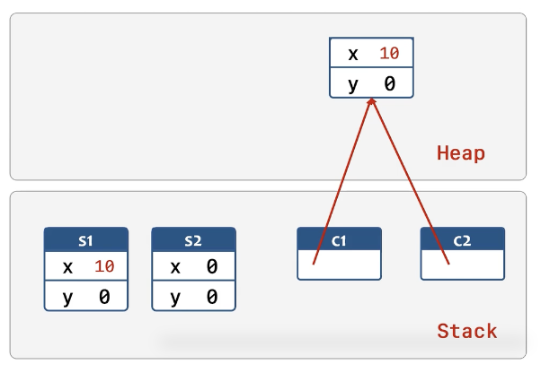
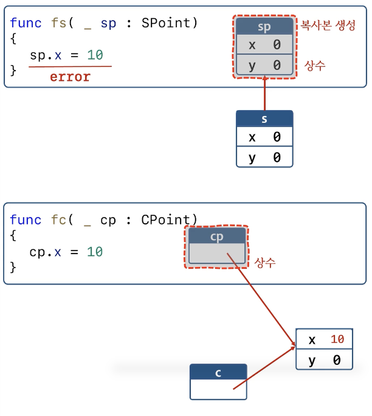
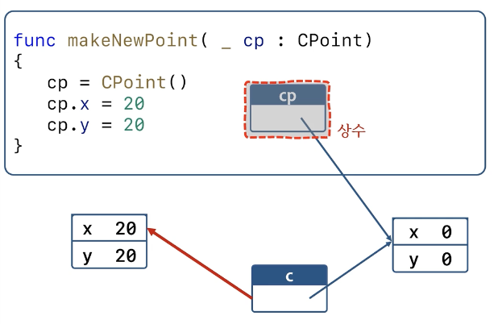

# OOP 1

## OOP Basic

### OOP

- 사각형의 면적을 구하는 함수를 만들고 싶다고 할 때
- 사각형이라는 형태가 없기 때문에 l,t,r,b의 네가지 값을 사용한다. -> 복잡해 보인다.
- 프로그램에서 "사각형"을 다루고 싶다면 사각형의 좌표를 나타내는 값 4개를 사용하는 것 보다 "사각형 타입"을 만들어서 사용하는 것이 좋다.
- C언어 : `struct`
- C++, Java, C#, Swift : `struct`, `class` 

```swift
func getRectArea(left: Double, top: Double, right:Double, bottom: Double) -> Double {
  return (right - left) * (top - bottom)
}

print(getRectArea(left: 0.0, top: 3.0, right: 5.0, left: 0.0))
```

```swift
class Rectangle {
  var left = 0.0	// 프로퍼티
  var top = 0.0
  var right = 0.0
  var bottom = 0.0
  
  func inflate(width: Double, height: Double) {
    right += width
    bottom += height
  }	// 메서드
  
  init(left: Double, top: Double, right: Double, bottom: Double) {
    self.left = left
    self.top = top
    self.right = right
    self.bottom = bottom
  }
}

var rc = Rectangle(left: 0, top: 0, right: 5.0, bottom: 7.0)

rc.inflate(width: 3.0, height: 5.0)
rc.left = 10.0
```

### 용어 정리

- 프로퍼티(property) : 멤버데이터, 필드
- 메서드(method) : 멤버 함수, 메서드
- Initializer, init() : 생성자
- deinit : 소멸자
- Type method : static 메서드
- 인스턴스 : 객체

### 접근 지정자

- `private`
- 생략시 `interal`. 같은 모듈의 모든 소스에서 접근 가능. 
- 간단한 코드 작성시 생략하는 경우가 많음.
- 파일이 커지고 코드의 양이 많을 때는 많이 사용하게됨.


## Value Type & Reference Type



- Value type : struct, enum, tuple ...	( 그냥 스택 메모리에 쌓임)
- Reference type : class, function, closure ...   (동적으로 메모리 할당. 레퍼런스 타입의 실제 객체들은 힙메모리에 올림)

```swift

struct SPoint {
  var x = 0
  var y = 0
}

class CPoint {
  var x = 0
  var y = 0
}

var s1 = SPoint()
var s2 = s1

var c1 = CPoint()
var c2 = c1

s1.x = 10
c1.x = 10

print(s2.x)	// 0
print(c2.x)	// 10
```

```swift
struct SPoint {
  var x = 0
  var y = 0
}

class CPoint {
  var x = 0
  var y = 0
}

let s = SPoint()
let x = CPoint()

s.x = 10 // error. s는 상수이기 때문임.
c.x = 10 // ok. c 자체가 바뀌는게 아니기 때문. 포인터가 상수냐, 포인터가 가리키고 있는게 상수냐.
c = CPoint() // error
```

- value 타입과 reference 타입을 함수 인자로 보냈을 때



```swift
struct SPoint {
  var x = 0
  var y = 0
}

class CPoint {
  var x = 0
  var y = 0
}

func fs( _ sp: SPoint) {
  sp.x = 10
}

var s = SPoint()

fs(s)	// error

func fs( _ sp: inout SPoint) {
  sp.x = 10
}

fs(&s) // ok.


func fc( _ cp: CPoint) {
  cp.x = 10
}

var c = CPoint()

fc(c)
print(c.x) // 10
```



```swift
class CPoint {
  var x = 0
  var y = 0
}

func makeNewPoint( _ cp: CPoint){
  cp = CPoint()
  cp.x = 20
  cp.y = 20
}


var c = CPoint()
print(c.x, c.y)	// 0, 0

makeNewPoint(c)
print(c.x, c.y)	// error

func makeNewPoint( _ cp: inout CPoint){
  cp = CPoint()
  cp.x = 20
  cp.y = 20
}

makeNewPoint(&c)
print(c.x, c.y)	// 20, 20

```

