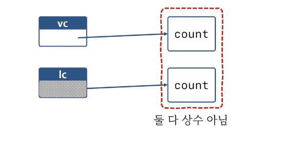

# OOP2

## instance equality

- `===` vs `==`
  - `===` : 두 개의 래퍼런스가 동일한 인스턴스(객체)를 가리키는지 조사
  - `==` : 인스턴스(객체)의 상등성 조사. 사용자 정의 타입일 경우 "`==` 타입 메서드"를 만들어야 한다. (Equatable protocol) 사용
- Equatable 프로토콜 (`==`, `!=`을 위한)
  - reference 타입 : Equatable 프로토콜을 사용자가 직접 구현
  - value 타입 : Equatable을 채택하기만 해도 Default 구현이 되어 있기 때문에 상등 연산이 가능해 진다. 좀 더 상세한 조건을 주기 위해서는 reference 타입에서처럼 구현하면 된다.

```swift
class CPoint {
  var x = 0, y = 0
  init(x: Int, y:Int) {
    self.x = x
    self.y = y
  }
}

var c1 = CPoint(x:1, y:1)
var c2 = c1
var c3 = CPoint(x:1, y:1)

print(c1 === c2)	// true
print(c1 === c3)	// false
print(c1 == c2)	// error. 따로 구현해 줘야한다.
print(c1 == c3)	// error. 따로 구현해 줘야한다.

// == 연산이 에러가 안나오게 하기 위해서
// Equatable 프로토콜을 채택하는것이 좋다! 안써도 되긴 함.
class CPoint: Equatable {
  var x = 0, y = 0
  init(x: Int, y:Int) {
    self.x = x
    self.y = y
  }
  
  // 연산자 메서드
  static func == ( p1: CPoint, p2: CPoint) -> Bool {
    return p1.x == p2.x && p1.y == p2.y
  }
}
```

```swift
struct SPoint {
  var x = 0, y = 0
  init(x: Int, y:Int) {
    self.x = x
    self.y = y
  }
}

var s1 = SPoint(x:1, y:1)
var s2 = s1
var s3 = SPoint(x:1, y:1)

print(s1 === s2)	// error. value 타입일때는 의미 없다.
print(s1 === s3)	// error. value 타입일때는 의미 없다.
print(s1 == s2)	// error. 따로 구현해 줘야한다.
print(s1 == s3)	// error. 따로 구현해 줘야한다.

// 아래처럼 하면 == 연산 가능해짐.
struct SPoint: Equatable {
  var x = 0, y = 0
  init(x: Int, y:Int) {
    self.x = x
    self.y = y
  }
}

print(s1 == s2)	// x,y가 모두 같을때만 true
print(s1 == s3)	// x,y가 다르면 false

```

<br>

## Class vs Struct

- Struct와 Class의 공통점
  - 값을 저장하는 프로퍼티 정의
  - 기능 제공을 위한 메서드 정의
  - 서브 스크립트 정의
  - 초기화 상태를 설정하기 위한 초기화 (init)정의
  - 확장(extension) 정의
  - 특정 종류의 표준 기능을 제공하는 프로토콜 준수 가능
- Struct와 Class의 차이점
  - Struct : value type, 상속 불가능, is-as 사용 불가능, deinit(소멸자) 불가능
  - Class : reference type, 상속 가능, is-as 사용 가능, deinit(소멸자) 사용 가능

```swift
class Base {}
class CPoint: Base {}
struct SPoint: Base {}	// error. 상속 불가능.

```

- **Struct method에서는 property 값을 수정할 수 없다.**
  - 수정하려면 `mutating` 키워드를 표기해야한다.

```swift
class Counter {
  var count = 0
  func increment() {
    count += 1
  }
}

var c = Counter()
c.increment

struct Counter {
  var count = 0
  func increment() {
    count += 1	// error. 구조체에서 메서드로 프로퍼티를 수정할 수 없다.
  }
  
  // 프로퍼티 수정을 위해서는 mutating 키워드를 사용한다.
  mutating func increment() {
    count += 1	// ok
  }
  
}

var s = Counter()
s.increment
```

- Class 타입은 let, var 어떤 걸로 선언하던지 내부의 값을 변경하는데 전혀 무리가 없다.



- 그럼 struct는? let으로 사용하면 값을 변경할 수 없다. 근데 **Swift는 변수보다 상수를 우선한다(권장한다)**. 그래서 규칙을 구조체는 메서드를 만들때 내부적으로는 멤버의 값을 바꿀 수 없다.
- 근데, 메서드로 멤버의 값을 바꾸고 싶을때 사용하는 mutating 키워드는 구조체가 상수로 선언되어 있을때는 마찬가지로 쓸 수 없다.
  - Mutating method
    - var : O
    - let : X
  - Non-Mutating method
    - var : O
    - let : O

```swift
class Counter {
  var count = 0
  
  func increment() {
    count += 1
  }
  
  func dump() {
    print(count)
  }
}

var vc = Counter()
let lc = Counter()

vc.increment()
lc.increment()

vc.dump()
lc.dump()


struct Counter {
  var count = 0
  
  mutating func increment() {
    count += 1
  }
  
  func dump() {
    print(count)
  }
}

var vs = Counter()
let ls = Counter()

vs.increment()
ls.increment()	// error. ls는 상수로 선언되었기 때문에 mutating 키워드로도 멤버 변수를 변경할 수 없다.

vs.dump()
ls.dump()
```

- struct는 initializer을 만들어 주지 않아도 property 이름으로 사용할 수 있도록 default로 함께 제공을 해준다. 물론 class도 default initializer가 있지만 property 이름으로 바로 사용할 순 없다.

```Swift
class CPoint: { var x = 0, y = 0}
struct SPoint: { var x = 0, y = 0}

var cp1 = CPoint()	//	ok
var cp2 = CPoint(x: 10, y: 10)	// error

var s1 = SPoint()	// ok
var s2 = SPoint(x: 10, y: 10)	// ok
```

