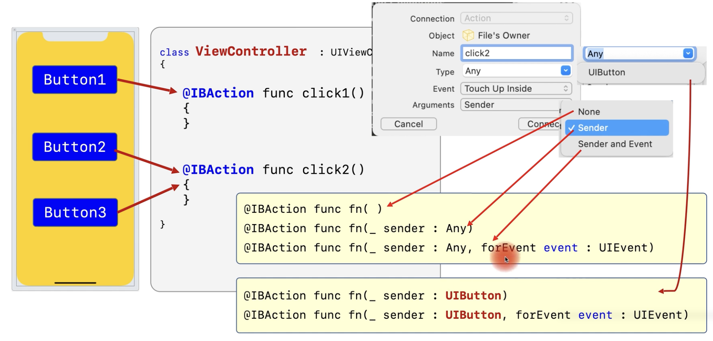

# 5. IBAction & IBOutlet

### @IBAction

- 컨트롤에서 발행하는 이벤트를 처리하는 함수 앞에 붙이는 지시어

```swift
@IBAction func button_click(){}
```

### @IBOutlet

- 컨트롤과 연결된 변수(객체) 앞에 붙이는 지시어

```swift
@IBOutlet weak var msgLabel: UILabel!
```


## Action method



- 2개의 버튼을 하나의 @IBAction 함수에도 연결할 수 있다.
- @IBAction 함수는 크게 3가지 형태로 만들 수 있다.

```swift
// 1. 인자가 없는 경우
@IBAction func fn()
// 2. 인자가 1개인 경우
// 인자가 1개일 경우 sender로 버튼의 참조가 넘어온다.
// Any타입으로도 받을 수 있고, UIButton 타입으로도 받을 수 있다.
// Any 타입으로 받으면 타입 캐스팅 해서 써야함.
// let btn = sender as! UIButton
@IBAction func fn(_ sender: Any)
@IBAction func fn(_ sender: UIButton)
// 3. 인자가 2개인 경우
@IBAction func fn(_ sender: Any, forEvent event: UIEvent)

```


### ".xib"와 "ViewController"를 만드는 방법

- 하나의 화면은 ".xib"와 "ViewController"로 구성된다.
- 관례적으로, xib 파일의 이름은 뷰 컨트롤러와 동일한 이름으로 사용한다.

1. 각각 별도로 추가
   - 반드시 .xib의 Files owner의 클래스 이름과 view outler을 연결해야 한다.
2. 2개의 파일을 동시에 추가
   - view outlet 속성이 자동으로 연결됨.
   - 새로운 파일 만들때 cocoa touch로 하고, create XiB file을 체크해주면 된다.

