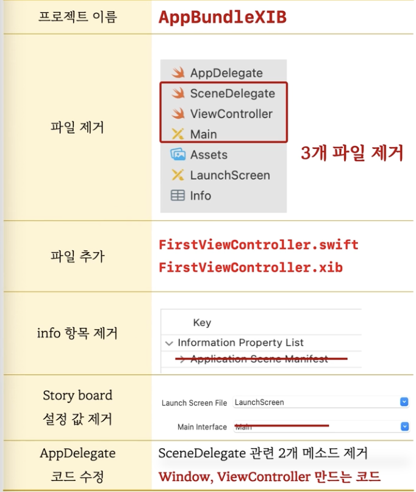

# 6. XIB & NSBundle



<br>

### Car 타입의 객체를 만드는 2가지 방법

1. 코드로 작성
   - `let c = Car()`

2. .xib 파일을 사용해서 객체를 생성
   - 단, **NSObject로 부터 상속받은 타입**만 가능
   - .xib 파일은 UI 뿐 아니라 NSObject로 부터 상속받은 모든 타입의 객체를 생성할 수 있다.
   - 새 파일을 만들때 Empty로 만들어서 요소를 추가할 때 object를 추가해 주면 된다. class도 연결해주고!

<br>

### .xib 파일을 Load 하는 방법

1. ViewController를 만들면서 load
   - 이 경우는 View를 만들기 위한 xib load 하는 거다.

```swift
let vc = ViewController(nibName: "ViewController", bundle: nil)
```

2. Bundle 객체의 "loadNibName" 멤버 함수를 사용해서 load
   - xib가 load 되면 xib안에 있는 모든 객체가 생성되고, **"모든 객체의 참조를 담은 배열을 반환(optional type)"**

```swift
let bundle = Bundle.main
let arr = bundle.loadNibNamed("myxib", owner: nil, option: nil)

let c = arr![0] as! Car
c.go()
```
