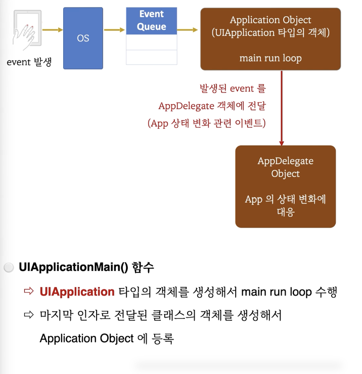
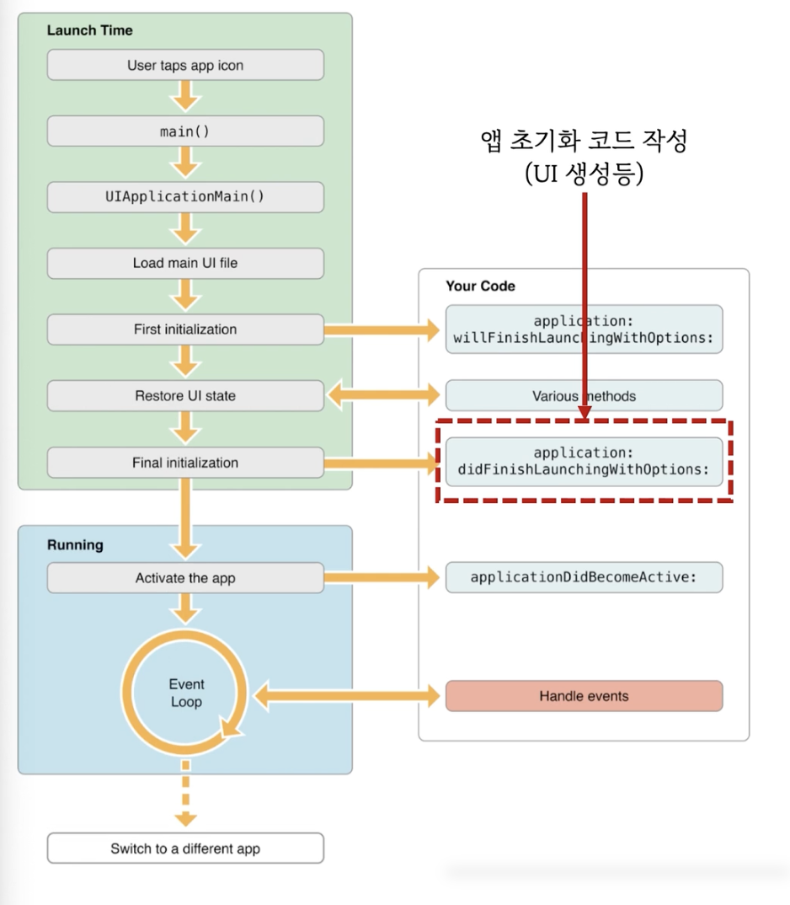
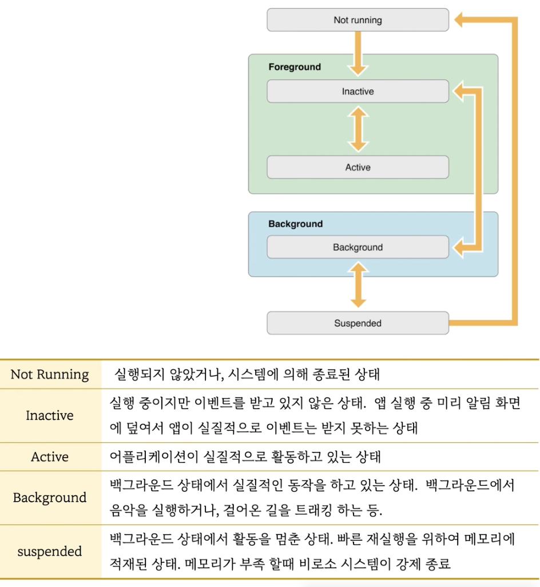

# 1. AppDelegate

## iOS 프로그램이 지켜야하는 규칙

1. **"UIApplicationDelegate"** 프로토콜을 채택한 클래스를 만들어야한다.
   - 관례적으로 **"AppDelegate"** 라는 클래스 이름을 사용함

```swift
import UIKit
class AppDelegate: UIResponder, UIApplicationDelegate {
  
}
```

2. main.swift에서
   - **"UIApplicationMain()"** 함수 호출
   - 4번째 인자로 "(1)에서 만든 클래스 이름(AppDelegate) 전달"

```swift
import UIKit

let argc = CommandLine.argc
let argv = UnsafeMutableRawPointer(CommandLine.unsafeArgv).bindMemory(to: UnsafeMutablePointer<Int8>?.self, capacity: Int(CommandLine.argc))

// 여기서 4번째 인자에 Appdelegate
UIApplicationMain(argc, argv, nil, NSStringFromClass(AppDelegate.self))
```

<br>

## 위 내용이 그래서 뭔데?



1. 아이폰을 터치하거나 만지다 보면 event가 발생
2. 발생된 이벤트는 운영체제(OS)로 가게됨.
3. OS는 발생된 이벤트를 Event Queue에 집어넣음
4. 우리는 프로그램에서 해야하는게 Event Queue에서 Event를 하나씩 꺼내와야함.
5. 그러기 위해서 iOS는 Application Object를 하나 만들어야함 (UIApplication 타입의 객체). 얘가 run loop라는 것을 실행하면서 Event Queue에서 Event를 꺼내옴.
6. **UIApplicationMain()** 함수는 UIApplication 타입의 객체를 생성해서 main run loop를 수행함.
7. 그래서 우리 프로그램은 종료되지 않고 계속 실행되는거임.
8. 근데 단순히 이벤트를 꺼내오는데서 그치지 않고, 우리는 그 이벤트를 처리하는 코드를 작성해야함.
9. **UIApplicationMain()** 함수는 마지막 인자로 전달된 클래스의 객체(AppDelegate)를 생성해서 Application Object에 등록
10. Application Object는 어떤 일이 생길때마다 (event가 발생할때마다) 발생된 event를 AppDelegate 객체에 알려줌 (App 상태 변화 관련 이벤트). 즉 어떤 함수를 호출하게됨.
11. 따라서 AppDelegate 객체에 있는 어떠한 함수를 호출함에 따라 AppDelegate Object는 App의 상태 변화에 대응하게됨.

### Flow



- 위 과정에 따라 실행되면서, 약속된 함수들이 호출된다.
- 일반적으로 프로그램이 처음 실행될 때 초기화 되는 코드는 `application: didFinishLaunchingWithOptions:`  함수에서 만드는게 관례
- 저기다 UI code 작성하는게 또 관례

<br>

## App의 상태 변화



- 위 상태변화에 따른 일들을 AppDelegate에서 처리하게 됨.

- 단, iOS 12이전과 iOS13 이후는 차이점이 존재. iOS 13부터는 SceneDelegate 개념이 추가됨.

<br>

## @main

>  프로젝트 설정 화면에서 Build Phase에서 Compile Sources에서 main을 빼고 실행을 하면 main을 컴파일 하지 않기 때문에 빌드 에러가 발생한다.

> 하지만 AppDelegate 위에 @main을 작성하면 실행이 된다.

- Application의 진입점 클래스를 지정
- 즉 main.swift를 만들 필요가 없다.
- **"@main"**이 아래 코드의 역할을 다 해준다

```swift
import UIKit

let argc = CommandLine.argc
let argv = UnsafeMutableRawPointer(CommandLine.unsafeArgv).bindMemory(to: UnsafeMutablePointer<Int8>?.self, capacity: Int(CommandLine.argc))

// 여기서 4번째 인자에 Appdelegate
UIApplicationMain(argc, argv, nil, NSStringFromClass(AppDelegate.self))
```

- 예전에는 **"@UIApplicationMain"** 사용
- 시간이 되면 UIApplicationMain 인터넷 검색하자. iOS App의 entry-point에 대한 보다 자세한 다양한 자료들을 볼 수 있음.


### 자 이제, AppDelegate는 써야한다는걸 알았으니, 프로젝트 만들고 기존 파일 삭제시 AppDelegate는 빼고 삭제하면 된다!

- 근데, 기본적으로 생성되는 AppDelegate에서는 SceneDelegate와 관련된 메서드도 정의되어 있는데, 이건 삭제하는게 좋다 (간혹 경고 뜰수가 있다.)	
