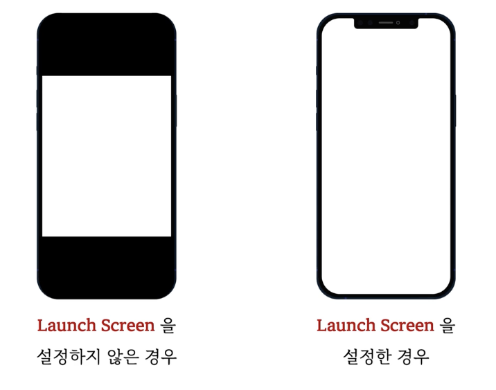
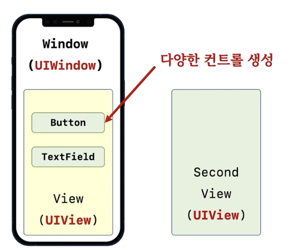

# 2. UIWindow & UIView

## Window를 생성하는 방법

- **UIWindow** 클래스 사용
- Window를 생성하는 전형적인 코드

```swift
var window: UIWindow?

window = UIWindow()
window?.backgroundColor = UIColor.white
window?.rootViewController = UIViewController()
window?.makeKeyAndVisible()
```



### Launch Screen 설정

- 새 파일 -> "Story Board" -> "Launch Screen"  파일 추가
- 프로젝트 설정 화면에서 Launch Screen 항목 설정


## UIView



- 그냥 Window위에다 UI를 그리면 되지, View를 붙이는 이유는?
  - View를 여러개 그릴 수 있고, 어떤 View로 교체를 하면? 화면이 바뀌는것 처럼 보인다.
- Window는 처음 만들어서, 앱이 종료될 때 까지 놓이는 것.
- View는 실행하면서 교체도 하고 제거도 하고.

```swift
// View를 만들어 window 안에 넣기
let rc = CGRect(x:100, y:200, width: 200, height: 400)
let view = UIView(frame: rc)
view.backgroundColor = UIColor.yellow
window?.addSubview(view)

// button을 만들어 View 안에 넣기
let btn = UIButton(type:UIButton.ButtonType.roundedRect)
btn.frame = CGRect(x:50, y:100, width: 100, height: 100)
btn.backgroundColor = UIColor.green
view.addSubview(btn)
```


