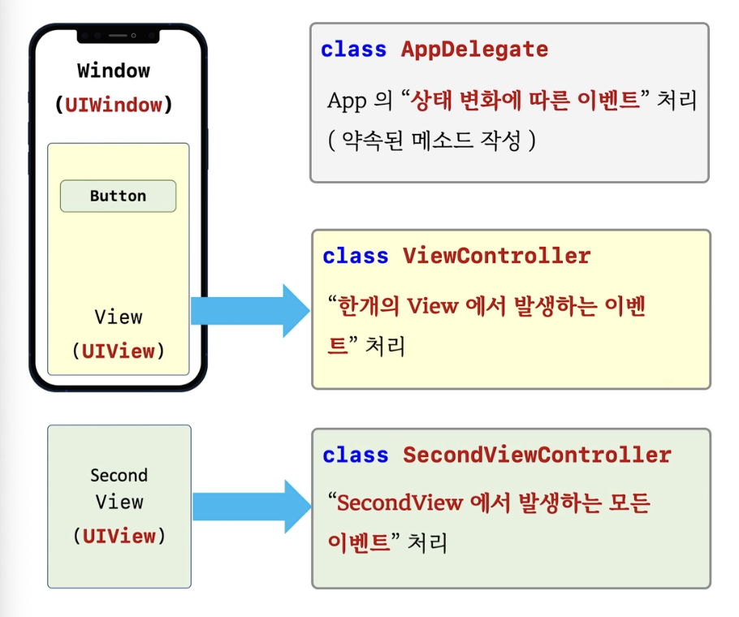

# 3. ViewController



### AppDelegate의 역할

- App의 "상태 변화에 따른 이벤트" 처리 (약속된 메소드 작성)
- Foreground에 있을때, background에 있을때, 배터리가 없을때...
- AppDelegate에서 GUI에서 나오는 이벤트를 처리하려고 하면 너무 비대해진다.
- 그래서, View에서 나오는 다양한 이벤트를 처리하기 위해 ViewController를 사용한다.

### ViewController의 역할

- **"한개의 View에서 발생하는 이벤트"** 처리
- 하나의 ViewController에서 여러개의 View를 다 처리하면 또 복잡해 지니까 View 하나당 VC 하나를 만들어서 각각 이벤트 처리.

## ViewController 클래스

- View를 만든 프로그램에서는 반드시 ViewController 클래스가 필요하다!
- 한개의 View에서 발생하는 이벤트를 처리하기 위한 클래스
- **반드시 UIViewController 클래스로 부터 상속 받아야 한다.**

```swift
let vc = FirstViewController()
vc.view = view

window?.rootViewController = vc // vc.view를 윈도우에 자동으로 붙여줌.
```


- **window는 rootViewController를 통해 자신의 첫번째 View의 컨트롤러를 알게 되고, 컨트롤러는 view라는 프로퍼티를 통해 연결되게 된다.**


## 버튼 연결하기

### @IBAction

- View에서 발생하는 이벤트를 처리하기 위한 함수 앞에 붙이는 지시어
- @objc도 사용 가능 (object-c와 연동되는 함수 앞에 붙이는 지시어)
- 관례적으로는 @IBAction 많이 사용.
- 버튼의 이벤트와 이벤트를 연결하는 것을 흔히 **Target-Action 패턴**이라고 한다.


### 정리

