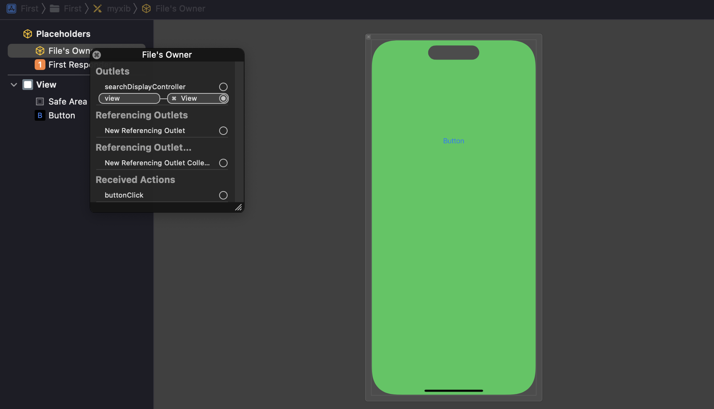
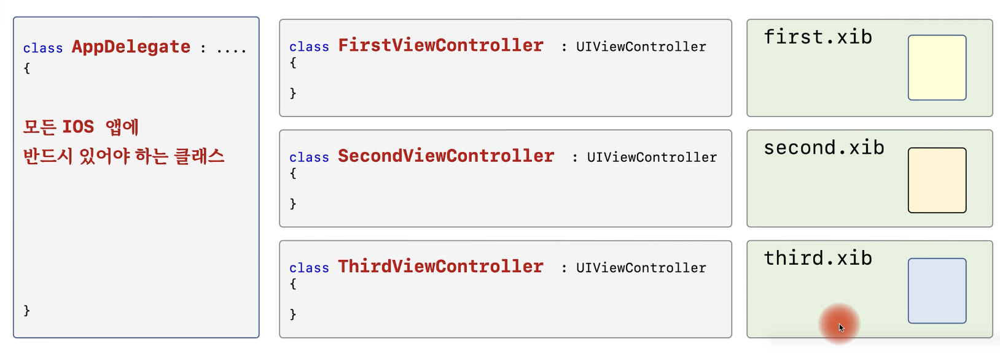

# 4. XIB

> UI를 코드로 구현할 수 있지만, 매우 길어질 것이다.

## UI를 만드는 방법

1. 코드로 직접 UI 객체를 생성
   - 장점 : 이해하기 편하다
   - 단점 : UI가 복잡하면 코드도 길어지고 복잡해질 것이다.
2. .xib 파일을 사용해서 UI객체를 생성

### .XIB 파일

- View와 다양한 컨트롤을 만드는 XML 파일
- UI 디자인을 편리하게 할 수 있다.
- 예전에는 **.nib** 확장자를 사용했었다.

```swift
let vc = ViewController(nibName: "xib파일 이름", bundle: nil)
```

### .XIB 파일에 포함할 내용

- view와 버튼에 대한 생성 정보
- ViewController와 view 연결 (vc.view = view)
- 버튼에 대한 이벤트 처리 정보 (버튼의 이벤트와 ViewController의 메서드 연결)


## .xib 파일을 사용해서 UI를 만드는 방법

1. .xib 파일 추가

   - New File -> "View" 또는 "Empty" 선택 (둘 다 xib 파일임)
   - View를 선택하면 내부적으로 View를 가지고 있음.

2. Library 창에서 View와 버튼 추가

   - `+` 버튼 또는 `Command + Shift + L`

3. ViewController의 "view" 속성 연결

   - File's owner의 class 이름 설정

   - File's owner에서 오른쪽 버튼 클릭 후 view 속성을 연결

     

   - 이것은 `vc.view = view` 와 동일한 의미이다


## 정리

- 하나의 화면 (Scene)은 ".xib파일 + ViewController 클래스"로 나타낸다.


- 여러개의 view를 가진 프로그램을 작성하려면?


