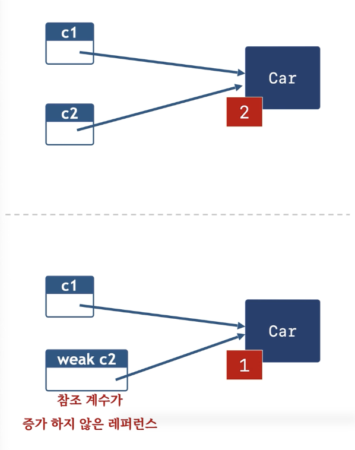
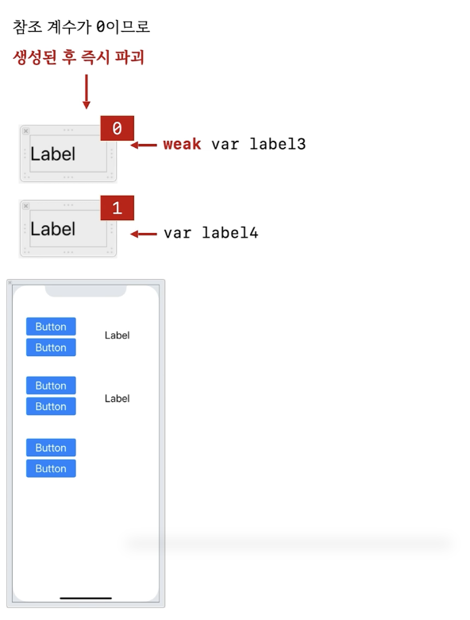

# 7. weak & strong

```swift
class Car {
  func go() {print("Car go")}
  
  init() {print("Car init")}
  deinit() {print("Car deinit")}
}

func f1() {
  var c1: Car? = Car()
  var c2 = c1
  
  print("---------[A]")
  c1 = nil
  print("---------[B]")
}

f1()
// Car init
// ----------[A]
// ----------[B]
// Car deinit

func f2() {
  var c1: Car? = Car()
  weak var c2 = c1
  
  print("---------[A]")
  c1 = nil
  print("---------[B]")
}
f2()
// Car init
// ----------[A]
// Car deinit
// ----------[B]

```



- Swift 언어에서는 객체의 수명을 관리할 때 reference counting이라는 개념을 사용함
- 위 예제에서, c2가 정의되는 경우에는 c1이 nil이 되어도 Car라는 객체는 여전히 참조가 남아있다. 따라서 deinit이 호출되는 시점은 f1 함수가 끝나는 타이밍이다.

- Weak 변수 : 참조 계수가 증가하지 않은 레퍼런스


## 실제로 weak와 strong으로 구현한다면


- UIView 클래스 안에는 subviews: [UIView]로 참조로 들어간다.

- 어떤 컨트롤들을 view에서 땠다가 붙였다가 하려면 strong으로 해야하고, 그냥 붙이기만 할거라면 weak로 해야한다.

### View 안에 있는게 아니라 밖에 있을때

