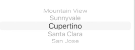

# 8. DataSource & Delegate

- UIPickerView를 사용한다고 하자.

### UIPickerView에 데이터를 채우는 방법

1. pickerview의 "data source"와 "delegate"를 "File's Onwer"에 연결

2. ViewController 클래스에 아래 2개의 프로토콜 구현
   - UIPickerViewDataSource
     - 보통 항목을 채울 데이터를 요청
   - UIPickerViewDelegate
     - 보통 발생하는 이벤트를 처리

